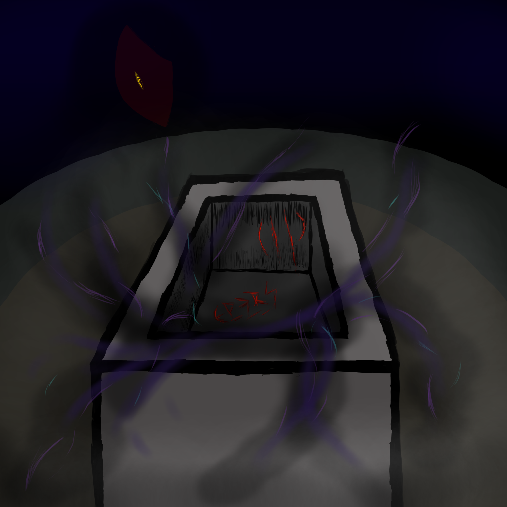

# TP 3 - SPRING

## Introducción al lore 
Luego de despertar, los recuerdos de aquella entidad espiritual mezcla de ángel y demonio, quedaron grabados a fuego en nuestras mentes. Es difícil explicar lo que vimos, ya que se encuentra en un nivel de comprensión mas allá de la capacidad humana, pero si reconocimos algunas cosas.

Pudimos vislumbrar en los recuerdos cementerios, donde los demonios habitan y se vuelven mas fuertes, y santuarios, hogar de los ángeles donde estos recuperan sus energías. Los ángeles y los demonios estan atados a estos lugares, incapaces de abandonarlos a no ser que esten conectados a alguien. Y en los recuerdos observamos cómo los demonios abandonaban los cementerios en grandes cantidades, junto a mediums que los conectaban a su cuerpo. 

Los ángeles se ven incapaces de abandonar los santuarios, llegar hasta los cementerios y neutralizar la situación, solo pueden defender los santuarios en los cuales están atados. Y sin un medium que los conecte y los baje al mundo terrenal, estos no pueden combatir contra los demonios, y son escasos los angeles con una conexión.

Una vez que nos recompusimos, comenzamos a investigar nuevamente, y con el paso de los dias notamos que en varios foros dedicados al espiritismo comenzaron a aparecer muchos posteos sobre eventos paranormales, en distintos sitios alrededor del mundo. La mayoria de historias seguian un patron, algun conocido desaparece durante la noche y la mañana siguiente reaparece como si nada, no queriendo explicar su desaparicion espontanea. Y desde su reaparicion comenzaron los eventos: las luces titilan, los objetos se mueven por si solos, juran que voces escalofriantes les susurran en la penumbra, y que el aire se siente frio y pesado cuando estan cerca de este conocido suyo.

Con el afan de llegar al fondo de este misterio, decidimos preguntar en los foros si los escritores de estas historias se encontraban cerca de algun cementerio o de algun santuario, y en todos los casos que hubo respuesta nos respondieron que afirmativamente cerca de sus hogares se encontraba un cementerio, el cual dias despues de los eventos que redactaron, estos cerraron sus puertas al publico por motivos de seguridad.

Sospechamos que a esto se debia referir la entidad espiritual con la que contactamos: Algun tipo de desequilibro se desato, tanto en el plano espiritual como en nuestro plano. Pareciera que la actividad espiritual, algo que antes sucedia muy poco y en lugares muy especificos, comenzo a manifestarse en todo el mundo siguiendo un mismo patron. Y los causantes fuimos nosotros, con nuestros experimentos y nuestra curiosidad por conocer mas sobre estos espiritus.

Con miedo e incertidumbre en nuestros corazones, discutimos que paso tomar a continuación y concluimos que si este desequilibrio lo causamos nosotros, lo debemos solucionar nosotros, por el bien de los inocentes que se ven afectados por nuestra culpa, y para evitar que todo escale a un apocalipsis espiritual y ya no haya vuelta atras. Todo empezo con aquel enlace que ese misterioso usuario RDJ habia dejado en un post olvidado hace años. Nuestra paso a seguir era claro: Contactar con RDJ. No sabiamos como encontrarlo o contactarlo, pero por un lado habia que comenzar. Decidimos apuntar nuestra busqueda en cementerios, para buscar pistas. Fue en el cementerio Prado Soleado donde las hallamos.

Era una noche oscura, el viento silbaba una melodia lugubre a cada paso que dabamos rodeando las paredes del cementerio. Era el 5to cementerio que explorabamos esa semana, sin dar con ninguna pista. Armados con linternas, incienzo, crucifijos, radios espirituales, detectores de EMF y nuestras laptops, escondidos de la vista de los guardias de seguridad, entramos saltando el paredon con mucho esfuerzo. Alli dentro, todo se sentia distinto, el aire se volvio mas pesado, las nubes y las estrellas parecian haberse esfumado, el frio atravesaba todas las capas de camperas y abrigos que teniamos. El detector de EMF empezo a chillar, marcaba 5, la lectura mas alta posible; un segundo despues, se apago repentinamente. Las linternas, previamente probadas, ya no encendian. Uno de nosotros vio en la oscuridad un farol de mano en el suelo, lo tomo y lo encendio. No era la mejor iluminacion, pero era mejor que nada.

Caminamos por los pasillos de lapidas que nos rodeaban, con mucho miedo en nuestros corazones. Cada ruido, susurro o movimiento que desconociamos nos ponia en alerta. Se oian voces, como de gente en pena. A veces, un susurro de ayuda, a veces, nuestro nombre en el aire. Pero sospechabamos que eran trampas para terminar de quebrarnos, separarnos, asi que no les dimos importancia y decidimos permanecer juntos, unidos como equipo. 

Minutos de mucho terror caminando junto a las tumbas y lo que se escondia en la oscuridad pasaron hasta que llegamos a la catacumba principal, cuyas puertas se encontraban abiertas. Nuestras radios espirituales captaron una frecuencia: "Entren", decia una voz grave y distorsionada. Nos miramos desconcertados. Podia ser una trampa, pero era la primera vez que la radio se encendia desde que empezamos nuestras incursiones. Podria ser la pista que buscamos.

Detras nuestro, de repente, escuchamos movimiento, y con mucho esfuerzo vimos varias figuras acercandose. Eran 3, luego 4, luego 5, no dejaban de aparecer, no podiamos ver bien que eran. El miedo nos gano, y entramos corriendo a la catacumba, cerrando entre todos las puertas, dejando crucifijos, incienzos y sal en el piso, con la intencion de frenar a lo que sea que este afuera. Se escuchaban gritos y golpes del otro lado, llamandonos por nuestros nombres, incitandonos a salir.

Las radios se volvieron a encender:"Abajo", dijo la voz. Detras nuestro, unas escaleras. Bajamos, mientras la luz del farol parecia llegar a sus ultimas. Al bajar el ultimo escalon, llegamos a una habitacion grande, con muchas calaveras y huesos en el suelo. En el centro de la misma, un ataud abandonado se presentaba frente a nosotros, vacio, salvo por ciertos arañazos repletos de una brillate sangre antes de que una densa bruma con chispazos emanase para rodearnos. El farol se apago repentinamente, oimos un ruido y pudimos ver como del ataud parecia emanar algo. El ataud se estaba abriendo ante nosotros, y lo que sea que estuviese alli dentro, estaba siendo liberado.

<p align="center">
  
</p>

Mientras oiamos los gritos y los golpes cada vez mas intensos provenir de fuera, las radios se encendieron una ultima vez: "Me encontraron"

## Funcionalidad

Nuestros queridos y valientes programadores han notado que las ubicaciones poseen más propiedades de las que pensaban, y han registrado cómo estas tienen gran influencia en todo el plano astral.

### Ubicación

Se descubre que todas las ubicaciones poseen un flujo de energia fija que acompaña tanto a médiums como a espíritus de diversas formas. Esta energía también se representa, como las otras que conocemos, con un valor numérico positivo menor o igual a 100.

A su vez, descubren que hay dos tipos de ubicaciones.

#### Cementerios

- Este tipo de ubicación limita la invocación únicamente a espíritus demoníacos.
- Cuando un médium descansa en este tipo de ubicación, recupera su maná en un 50% de la energia que esta provee. No así los demonios que lo acompañen, quienes tienen ganan nivel de conexión equivalente a la energía que la ubicación disponga. Los espíritus angelicales, por otro lado, no pueden recuperarse en los cementerios.

_Ejemplo_: Si Yoh Asakura, que tiene 10 de maná, descansa en un cementerio que tiene una energía de 100, terminará teniendo 60 (10 actuales + 50).

#### Santuarios

- Este tipo de ubicación limita la invocación únicamente a espíritus angelicales.
- Cuando un médium descansa en este tipo de ubicación, recupera su maná en un 150% de la energía que esta provee. En este caso, los demonios no pueden recuperarse, y los ángeles ganan nivel de conexión equivalente a la energía que el santuario provea.

_Ejemplo_: Si Lorraine Waine, que tiene 10 de maná, descansa en un santuario que tiene una energía de 100, terminará teniendo 160 (10 actuales + 150) de maná.

### Movimiento

Se ha observado que no era adecuado que tanto médiums como espíritus _aparezcan_ de manera azarosa en diferentes ubicaciones, por lo que se ha comenzado a tener en cuenta el movimiento que estos realmente realizan.

Un médium puede moverse de ubicación en ubicación, lo que implica que también se muevan todos los espíritus que lo acompañan. Los demonios perderán 10 unidades de nivel de conexión siempre que arriben a un santuario, mientras que los ángeles perderán 5 unidades de nivel de conexión cuando lleguen a un cementerio.

Si al movernos entre ubicaciones, alguno de nuestros espiritus perdiese todo su nivel de conexión, este debería desvincularse del Medium que se movio, quedando libre en la nueva ubicación.

_Aclaración_: Un espíritu no puede moverse por sí solo, solo podrá moverse siempre y cuando esté acompañando al médium al que se encuentra conectado, o en caso de que esté libre si se trata de una invocación.

## Servicios

Dada la evolución de nuestros programadores durante el desarrollo del modelo, se requiere de una representación más flexible para nuestros servicios, por lo que se pide que cambien las firmas de los metodos que retornan una entidad por una firma del estilo `Optional<entity>` cuando se recupera una entidad individualmente

```diff
- Espiritu recuperar(Long idDelEspiritu)
+ Optional<Espiritu> recuperar(Long idDelEspiritu)
```

Se solicita, ademas, que se agreguen los siguientes métodos en los servicios correspondientes:

### MediumService

- `void mover(Long mediumId, Long ubicacionId)` - Se debe aplicar la lógica de movimiento mencionada en la sección de [movimiento](#movimiento).
- `void exorcizar(long idMedium, long idMedium2)` - A partir de ahora, para que un Medium intente exorcizar a otro, deben estar en la misma ubicación.

### EstadisticaService

- `ReporteSantuarioMasCorrupto santuarioCorrupto()` - Devuelve un objeto de tipo reporte que indica cuál es el santuario con mayor diferencia de demonios sobre ángeles. Dicho reporte deberá contener el nombre del santuario, el médium con la mayor cantidad de demonios, la cantidad total de demonios y la cantidad de demonios libres (no ligados) que se encuentran en dicho santuario.

## DTOs

Nos hemos enterado de que otro grupo de programadores, liderado por un misterioso usuario con la firma _"J"_, estaba al tanto de lo que se estaba desarrollando y ha realizado grandes avances en lo que respecta al Frontend, para tener una representación visual de nuestra aplicación. Ya poseen una interfaz semi-funcional lista como prototipo y nos comentan que, para comenzar con la integración, necesitan que definamos los DTOs (Data Transfer Objects) para que puedan comenzar con la implementación. Será nuestro trabajo entonces, definir los DTOs y discutirlo con el equipo de Frontend.

### Integración a Spring

Además, nos interesará:

- Pasar la transaccionalidad de todos los servicios con todos sus métodos a Spring.
- Que los DAOs implementen la interfaz de Spring 'CRUDRepository' en lugar del DAO genérico previsto en el TP anterior.
- Crear controladores REST para todos los servicios implementados hasta ahora y los implementados en este TP también.
- Crear DTOs para generar un contrato de comunicación con el front. Dichos DTOs tienen que ser aprobados por el equipo docente, que se pondrá como representante del equipo de frontend.

### Se pide:

- Que provean implementaciones para las interfaces descritas anteriormente.
- Crear tests que prueben todas las funcionalidades solicitadas, con casos favorables y desfavorables.

## Bonus: Manejo de errores y auditoria de datos

Se nos pide implementar un manejo de errores en nuestra API, personalizando las respuestas de los controladores de la manera más descriptiva posible. Nuestro objetivo es evitar que los clientes o consumidores de nuestra API obtengan la información directa de qué causó el error (un stacktrace), y en su lugar, proporcionar un error con una descripción comprensible que no solo comunique algún error de uso de la API, sino que también oculte cualquier tipo de información sensible.

Como recomendación, consideren qué excepciones deben manejar y qué código de respuesta las representa mejor. Por ejemplo, si se quiere crear una especie con un nombre repetido, la mejor descripción para el error sería algo como:

```
  response_code: 400
  description: No se puede crear una ubicación con nombre repetido
```

Ademas, con el fin de recopilar información sobre los espiritus de manera más precisa dentro de nuestra base de datos, se decidio añadir 3 campos de auditoria a las entidades que persistimos, los cuales son los campos `Date createdAt`, `Date updatedAt` y `Boolean deleted`, los cuales nos permitiran:

- Registrar el momento de creación de una entidad
- Registrar la ultima modificación de una entidad
- Marcar una entidad como "eliminada" de manera lógica en la base de datos _(alineado con la estrategia de soft-delete o borrado lógico)_

**IMPORTATE:** un espiritu eliminado ahora permanecera registrado en la base de datos, pero no debera ser tenido en cuenta a la hora de realizar queries como `espiritusDemoniacos` o similares
