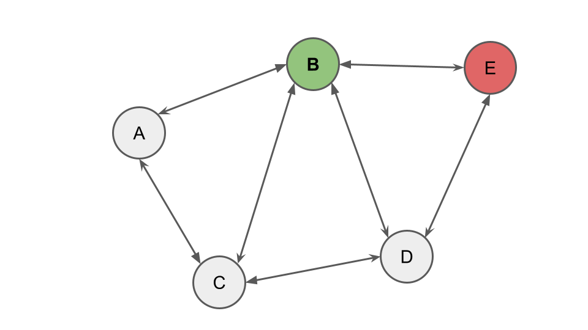

# TP 4 - NoSQL - Neo4J
Un maremoto de terror primigenio nos devoró tras la apertura del ataúd en las entrañas húmedas del cementerio. En ese breve instante, asfixiados por el temor hacia lo inefable, sentimos como algo dentro nuestro se había desaparecido y transferido a otro lugar. Algo tan sutil como un aliento, tan definitivo la extinción de una estrella. 

Cuando la sensación finalmente cedió, sólo quedó la certeza inquietante de que algo muy peligroso había sucedido, aunque no sabíamos que. En la tumba no encontramos nada.

Al salir de la catacumba, el cementerio parecía normal. Aunque nos sintieramos bien, terminamos ese día con la certeza de que algo que guardabamos con recelo sin saberlo había sido arrebatado de nosotros. 

Las semanas subsiguientes transcurrieron en una espiral descendente hacia la comprensión de lo incomprensible. La sensacion de pérdida de algo esencial en nosotros no desapareció, pero nos acostumbramos lo suficiente para continuar con nuestra misión. Los informes de desapariciones nocturnas aumentaban exponencialmente día tras día, y lo más inquietante: Una parodia grotesca del milagro de Lázaro; las personas aparecían al día siguiente, pero diferentes. 

Los bautizamos como "los poseídos". Cuando previas desapariciones solo resultaban en fenomenos extraños desarollandose alrededor de los desaparecidos, estos poseídos ya eran hombres directamente dominados por demonios y despojados de su humanidad, sembrando el caos por la ciudad, destruyendo todo a su paso, creando más poseídos de manera forzosa, corrompiendo almas inocentes y asesinando o torturando a quienes se resistíeran. Sea lo que sea que robaron de nosotros, los demonios lo estaban utilizando para forzar su conexión sobre almas inocentes. 

A espaldas del caos, refugiado en mi lecho, una pregunta me atormentaba noche tras noche como una espada de damocles suspendida sobre mi cordura: ¿Por qué osamos introducirnos en aquellos dominios ocultos? ¡Todo esto era nuestra culpa! ¿Por qué volamos hacia el sol del conocimiento prohibido cuando sabíamos que nuestras alas eran de cera y plumas?

Oh sabiduría profana, oh llama del saber, volamos hacia tu abrazo incandescente y no solo nuestras frágiles alas se consumieron en tu resplandor, sino que la negra cera que las unía ahora caía como lluvia de brea ardiente sobre las cabezas de corderos, ajenos a nuestras transgresiones, transformando su carne, deformando sus huesos, pervirtiendo sus almas inocentes. Y sin embargo he aquí mi más horrible confesión ¿Por qué persistía aún en mí este anhelo febril por saber más? ¿Por qué no podía parar de sentir el sabor metálico y tibio de mi propia sangre al morder fuertemente mis dedos, incapaz de sostener la ansiedad provocada por el éxtasis liberador de encajar una pieza más en este terrible rompecabezas infernal?

Podía ver en los rostros fantasmales de mis compañeros que no era el único cuyos párpados se negaban a cerrarse ante el terror de los sueños que aguardaban. Teníamos que terminar con esta pesadilla. 
Ya habiamos probado buscando respuestas en cementerios, y los resultados habian sido funestos. ¿Por que no probar ahora en los santuarios? 
Abrimos google maps y encontramos un viejo santuario francés aislado en las afueras de la ciudad. Según investigaciones posteriores, allí residían varios ángeles que podrían protegernos del continuo deterioro mental del cual ya no podíamos escapar. Ese seria nuestro proximo destino.

Fuimos alli y nos refugiamos en el santuario. La noche profundizaba su cernir sobre nosotros y el viento arremetía con tal intensidad que temíamos que el santuario pudiera derrumbarse. El tiempo era nuestro enemigo; los poseídos se multiplicaban sin cesar, y cada segundo perdido nos acercaba más a nuestra perdición y a la de todos.

Ya entrada la media noche, tras testear una simulación finalmente fallida en la que habíamos estado trabajando durante horas, las puertas del santuario se abrieron de golpe, dejando entrar de manera violenta el viento de la tormenta, volcando todo y apagando las luces. La oscuridad nos envolvió, rota únicamente por el pálido brillo de la luna que se filtraba a través de las puertas abiertas.

En esa tenue iluminación, distinguimos una silueta humanoide avanzando por el pasillo de entrada. Pero no caminaba; flotaba en el aire. Jamás habíamos visto algo así, y apenas tuvimos tiempo de asimilarlo antes de que todo a nuestro alrededor comenzara a levitar y a arder en llamas. Este poseído mostraba poderes que superaban cualquier cosa que hubiéramos visto antes.

El terror por nuestras vidas y la posibilidad de que todo hubiera sido en vano nos paralizó. Pero entonces, de repente, todo... se detuvo. Las llamas se extinguieron como si nunca hubieran existido, los objetos flotantes cayeron estrepitosamente al suelo, y el poseído se desplomó de rodillas frente a nosotros.

Una figura extraña emergió detrás de él, empapada como si hubiera surgido de las entrañas de la tormenta. Se acercó al poseído con una calma inquietante, posó sus dedos sobre su frente, y en un instante, el poseído cayó al suelo, inmóvil, incapacitado, exorcizado.

La figura nos miró entonces, sus ojos profundos y antiguos como abismos, y comenzó a caminar hacia nosotros. 

Un solo paso. 

Nuestros corazones se estremecieron. ¿Era salvación o condena lo que traía consigo? No lo sabíamos, pero de su ser emanaba una dualidad imposible: Una pureza angelical y una corrupción demoníaca que se entrelazaban en un torbellino de energías opuestas.

Dio un paso más.

Detrás de él, una sombra danzaba, girando como un remolino de humo oscuro, adquiriendo formas grotescas y retorcidas, una silueta que mutaba con cada latido, volviéndose cada vez más monstruosa, más tangible.

Otro paso.

El aire se volvió espeso, pesado, y un sudor frío comenzó a formarse detrás de nuestras nucas. 

Otro paso.

Una sensación de opresión y temor forzó a más de uno a caer de rodillas al suelo, incapaces de soportar el peso de lo que se acercaba. La sombra que lo seguía ahora se contorsionaba en una forma demoníaca, afilada, retorcida, hambrienta.

Finalmente, la figura llegó lo suficientemente cerca como para que podamos distinguir sus rasgos. Era un muchacho. Estaba agotado, con los ojos cargados de una preocupación insondable, como si su misma existencia fuera una carga demasiado pesada. 

Mantuvo una distancia cautelosa, pero su presencia lo llenaba todo.

“Veran, yo soy RDJ.”

<p align="center">
  
</p>

“Aunque no me comporte como tal, yo también soy un poseído.”

RDJ se veía como un muchacho joven, no muy distinto que cualquiera si se ignoraba su antebrazo, o mejor dicho, la ausencia de él. Su extremidad había sido brutalmente arrancada, dejando un muñón grotesco que aún chorreaba sangre oscura. Cada paso que RDJ daba parecía dejar una huella de sangre detrás, como si la propia tierra estuviera marcada por su dolor y su lucha.

“Estuve alli, cuando llegaron a la catacumba. Intente detenerlos, golpie en las piertas de la catacumba gritando sus nombres, pero fue demasiado tarde. Algo sucedio alli que me expulso del cementerio, pero ahora estoy aquí para ayudarlos a arreglar este apocalipsis.” - les dice, forzando una sutil sonrisa - “Todo esto tiene solución. Necesito que me acompañen a donde comenzó todo.”

Detrás de RDJ, el demonio observaba. El tambien habia estado alli, el fue quien robo algo de nosotros. No lo habiamos visto, pero lo sabiamos. Su figura oscura se contorsionaba en el aire como una sombra viva, imposible de definir con claridad, pero su único ojo, brillante y maligno lo veía todo. Una sonrisa torcida se dibujó en su rostro, sus colmillos reluciendo con una malevolencia palpable. Por más que RDJ les prometiera salvación, el demonio, en su risa cruel, nos recordaba que estabamos jugando un juego cuyo desenlace ya había sido escrito, y no a favor de nosotros.

Mis dedos aun lacerados se movian inquietos en mis bolsillos, al final, no pude evitar sonreir.

## Cambios en nuestra aplicación

Las ubicaciones resultaron ser aun mas importantes de lo que consideramos inicialmente, y una simple representacion relacional ya no basta para ser fieles a nuestro negocio. Su poder y notoriedad parece ir mas alla de las tablas y las columnas.

Como primer requerimiento de este TP, deberán de persistir las ubicaciones en Neo4J para poder modelar las conexiones entre ellas.

## Servicios

Deberan extender el `UbicacionService`, modificandolo de la siguiente manera:

- Los metodos `CRUD` deberan impactar tanto en Neo4J como en Posgress

- `void conectar(Long idOrigen, Long idDestino)` - Conecta dos ubicaciones existentes, siendo el resultado del metodo una conexión desde origen hacia destino.
  - Las conexiones no son bidireccionales por defecto, pero es valido que surja una conexión bidireccional si se conectan `(origen, destino)` y luego `(destino, origen)`

- `Boolean estanConectadas(Long idOrigen, Long idDestino)` - Denota si la ubicación origen esta conectada la ubicación destino por, unicamente, un salto de distancia.

- `List<Ubicacion> ubicacionesSobrecargadas(Int umbralDeEnergia)` - Retorna todas las ubicaciones del grafo que posean una cantidad de energía superior al umbral dado

- `List<Ubicacion> caminoMasCorto(Long idOrigen, Long idDestino)` - Dada una ubicación de la cual partir, y una a la que se quiere llegar, devuelve el camino de ubicaciones que menos saltos debe dar para alcanzar el destino. Si las dos ubicaciones no están conectadas por ningún camino, se levanta la excepción `UbicacionesNoConectadasException`.

- `List<ClosenessResult> closenessOf(List<Long> ids)` - Dada una lista de ids de ubicaciones, devuelve una lista de records ClosenessResults tras aplicar el algoritmo de Closeness Centrality a los nodos recibidos.

El record `ClosenessResult` es un record tal que:
```java
public record ClosenessResult(Ubicacion ubicacion, Double closeness) { }
```

Además, el metodo `mover` de `MediumService` ahora debera validar que la ubicación a la que se quiere mover este conectada directamente con la ubicación actual del medium. En caso de no estarlo, deberá arrojar la excepción `UbicaciónLejanaException`

## Centralidad y Closeness Centrality

### Centralidad
Dentro de la teoria de grafos y redes, se suelen asignar a los nodos un ranking y/o indice para definir que tan importantes son dentro de la red. Por poner ejemplos:

- En redes sociales, para medir la influencia o popularidad de un usuario
- En redes de internet o urbanas, para identificar a nodos clave dentro de la infraestructura
- En nodos de gente con mutaciones roboticas, para ubicar al infectado más contagioso

Como vemos, lo relevante cuando se habla de centralidad es definir **que tan importantes** son los nodos mediante un **criterio definido**

### Closeness Centrality
**Closeness Centrality** es un criterio que define la importancia de los nodos mediante el inverso de la suma de su distancia al resto de nodos en la red según su **camino más corto**.

Pongamos un ejemplo.

<p align="center">
  
</p>

En este grafo, si quisieramos calcular la centralidad del nodo B, deberiamos calcular su distancia con los nodos A, C, D y E, viendo que:

| nodo destino | distancia |
|--------------|-----------|
| A            | 1         |
| C            | 1         |
| D            | 1         |
| E            | 1         |

Sumando las distancias, obtenemos 4, por lo que la centralidad del nodo B según el criterio de Closeness Centrality 0.25. Justificación:
```
  sumatoria de distancias = 4
  inverso de la sumatoria = 1 / 4

  indice = 0.25 (resultado de 1 / 4)
```

Calculemos ahora la distancia de E para ver como muta el indice de centralidad.

| nodo destino | distancia |
|--------------|-----------|
| A            | 2         |
| B            | 1         |
| C            | 2         |
| D            | 1         |

En este caso, la sumatoria de la distancia nos da 6, por lo que el indice es 0.1666...

```
  sumatoria de distancias = 6
  inverso de la sumatoria = 1 / 6

  indice = 0.1666.. (resultado de 1 / 6)
```

Para calcular este algoritmo deberiamos, entonces:
```
- conseguir el nodo del que queremos conocer su centralidad
- calcular sus caminos más cortos hasta el resto de nodos de la red
- sumar la longitud de esos caminos
- dividir 1 entre la sumatoria
```

### Se pide:
- Implementar los requerimientos utilizando una base de datos orientada a grafos a su criterio.
- Extiendan el `UbicacionController` incluyendo los nuevos metodos implementados.
- Creen test unitarios para cada unidad de código entregada que prueben todas las funcionalidades pedidas, con casos favorables y desfavorables.

## Consideraciones
- Discutan en el equipo que entidades deben persistir en Neo4J, además de:
  - ¿Como persistirlo?
  - Si debe tener referencia a la *'fuente de verdad'* de la aplicación
- Los metodos estan planteados de manera tal que su dificultad sea incremental y, además, les sirva para encontrar las herramientas necesarias para los requerimientos posteriores.
- Se respalden en la documentación oficial de Neo4J para investigar como resolver algunos de los metodos.
- Recuerden que, al momento de crear la instancia de la base en Neo4J Desktop:
  - La contraseña debe ser `rootroot` (Neo pide 8 caracteres)
  - La versión de Neo4J que deben usar para la base es la `5.23.0`

## *~~Bonus~~* Investigación e Implementaciones extras

Luego de implementar el calculo de centralidad de los nodos viendo el *"que tan cerca"* estaban con **Closeness Centrality**, el equipo de desarrolladores, sentados a altas horas de la noche mientras admiraban las estrellas, charlaban tranquilamente, observando las constelaciones y definiendo formas para decidir que cuerpos celestes era el más importante: ¿Según su brillo? ¿Según si estaba en una constelación? ¿Incluso por su relación con algún signo zodiacal o similares?.

La charla siguio por horas hasta que algunos, embalados por sus ideas, decidieron implementar sus criterios en el sistema de las ubicaciones y decir cual era la mejor opción.

### 🔍 Investigación

Deberan investigar otros algoritmos de centralidad. Para ello, les dejamos un [enlace a Wikipedia](https://en.wikipedia.org/wiki/Centrality) donde veran listados algunos de los criterios y algoritmos (incluidas variables de algunos) usados para calcular la centralidad de los nodos en una red. Luego de leerlos, deberan de elegir uno (distinto a Closeness Centrality, obviamente) para implementarlo y comparar su performance contra el algoritmo de Closeness Centrality.

### 💻 Implementación

Tras elegir uno de los algoritmos, deberán implementarlo mediante una query de Cypher que lo ejecute sobre una lista de nodos que se reciban por parametro. Luego de implementarlo, deberán probarlo mediante Postman y mandar una captura de los tiempos que tarda en correr el algoritmo y retornar la respuesta. 

Para esto, tengan en consideración el crear un test que les genere una cantidad relevante de datos como por ejemplo: 100 nodos creados, conectados aleatoriamente con otros 10 nodos cada uno.

### 💡 Consejos
- Antes de implementar el algoritmo que eligieron, armen la logica en pseudocodigo (Para ejemplo, ver el pseudocodigo de Closeness Centrality). Una vez hecho eso, piensen como llevar dicha logica a Cypher.
- Utilicen el nombre del algoritmo elegido a la hora de nombrar el metodo de manera similar a como definimos el `closenessOf(ids)`
- Para la instanciación de los datos, considerar investigar por herramientas equivalentes al `JDBC Template` para Neo4J que nos permitan insertar nodos en la DB sin generar las instancias
