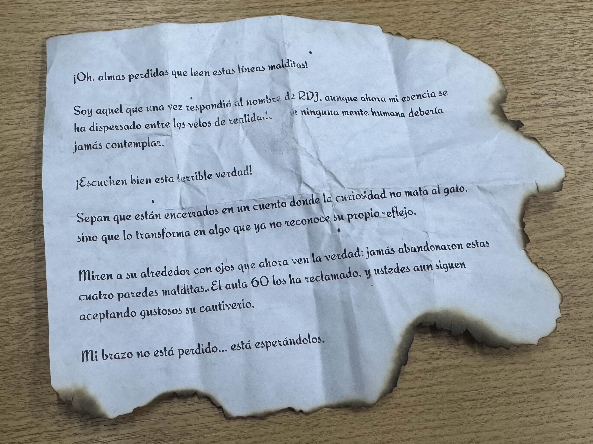
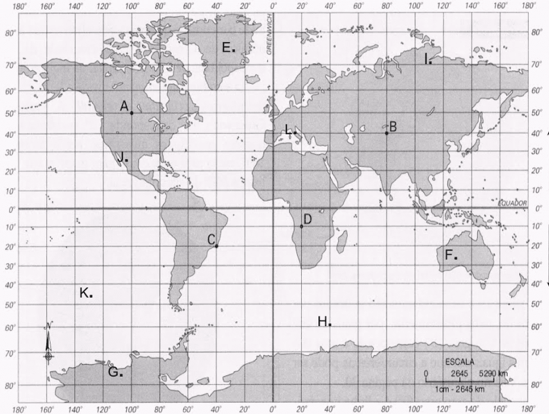
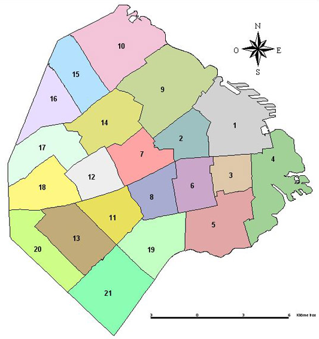

# TP 5 - NoSQL - MongoDB

## Intro

Bajo el manto púrpura de la noche ocultando nuestras figuras y la lluvia torrencial difuminando nuestros pasos, partimos del santuario rumbo al epicentro de nuestra condenación, la universidad de Quilmes, lugar y origen del primer ritual.

RDJ caminaba adelante en silencio. Su mirada, siempre penetrante, se postraba completamente al frente en el camino a transcurrir. En contraste a ese silencio insondable, las risas del demonio continuaban, y, sabiendo que paso a paso recorrido nos acercabamos aún más a la próxima revelación de un nuevo conocimiento prohibido, era imposible no contagiarse.

Llegamos a la universidad luego de lo que pareció una eternidad. El aula 60, donde había iniciado todo, se alzaba ante nosotros como un altar profano, sus paredes aún impregnadas de la resonancia de nuestras transgresiones pasadas.

Sin mediar palabra, RDJ dio un paso hacia adelante. El demonio, cuya sonrisa había crecido hasta deformar grotescamente las dimensiones de su rostro espectral, lo siguió flotando en el aire como una marioneta danzante.

"En el aula 60 perdieron más que la inocencia" - murmuró RDJ - "Aquí sacrificaron su humanidad en el altar del conocimiento vedado. Y ahora..." - RDJ No pudo terminar la frase.

Nuestros corazones se saltaron un latido.

<p align="left">
  
</p>

Con una voz aguda y desgastada, el demonio — esa presencia que había sido su sombra y su carga— comenzó a manifestarse en toda su gloria abominable. Pero no era la criatura que habíamos vislumbrado antes. Era algo infinitamente más terrible.

<p align="right">
  
</p>

El cuerpo espectral del demonio se expandió y retorció, convirtiéndose en un PORTAL viviente que respiraba con un ritmo obsceno.

Las paredes del aula comenzaron a sangrar una sustancia luminiscente que formaba caracteres en idiomas anteriores al lenguaje. Yo podía leerlos. Todos podíamos leerlos. Y esa comprensión nos llenaba de un terror delicioso que era al mismo tiempo agónico y eufórico.

Una luz segadora pronto vedo nuestros ojos

<p align="center">
  
</p>

### Coordenadas

Desde ahora, las ubicaciones que desarrolladas durante los TP anteriores pasaran a tener una coordenada de geolocalización que nos ayudarán a procesar mejor el comportamiento de las entidades de nuestro modelo.

### Dominio de espíritus

Como vimos en nuestras experiencias con RDJ, los espíritus ahora serán capaces de dominar y controlar a otros. Pese a no tener mucha información sobre este accionar, nuestras hipótesis nos llevaron a suponer las siguientes limitantes sobre estos seres.

- Los espíritus podrán dominar únicamente a los espíritus que estén en un rango de 2 a 5 kilómetros de alcance.
- Los espíritus podrán controlar únicamente a espíritus que no estén vinculados a médiums.

## Servicios

Se deberán modificar los siguientes servicios:

### MediumService

- `void pudrirse(Long mediumId)` - El médium se consume en su propia desesperación.

### EspirituService

- `Cadaver arrepentirse(Medium medium)` - EXORCISMO?… Cada espíritu dominado se vuleve una atadura más en el alma del medium.

### Cambios en el modelo

Los médiums… serán prisioneros de sus propias cadenas, atrapados entre planos que jamás entenderán. Las ubicaciones no son más que trampas, estructuras en la penumbra, sucias, corruptas...

- Las coordenadas son i̷n̸s̴i̸g̴n̵i̶f̷i̶c̸a̶n̶t̴e̵s̵. Lo que antes era un punto en el mapa ahora es un vortice hacia lo d̴̼͂ê̷̗̂s̴̤̅̉c̴͈̄̈ǫ̵̜̉n̷̥̹͗͊ŏ̴̘͌c̸͉͓̾̃ĭ̶̻d̵̥̮͂̋ȏ̷̯̼.
- L̵̤̐ỗ̶̥s̴͎͠ ̶̨̎̈́ȩ̶͘ṡ̵̫́p̸͇̦̓i̵̫͙̔͗r̴͕̬͆ĩ̵̉ͅẗ̶̠́̀ḭ̴̰̎̅s̷̼̓͝t̵̡͑a̸̰̹̍s̷̞͖̀ ̸͚̽͒s̴͙̫̍̓ö̸̬́͘n̵̨̬̏ ̷̼̆m̶̫͍̈́̈́ë̶͎́̏r̷̠̈͂ͅö̶̠̤́̓s̵̟͒ ̵̢͚̄̈́p̵̧͇̀̂è̷͇̭o̴̤̒n̸͓̞͌e̷̩̙̓̇s̸̻̔,̴͙̬̔͝ ̷̠̬̀̽p̸̣̮͆͝o̵̟̖͌s̵̫͒ḯ̸̙c̷̫̊ị̸̠̄o̴͜͠͠ǹ̴ͅa̷̪̘͝d̷̩͉͌o̶̘̞͊s̵̯̎͆ ̶̯̏p̵̢̓ȁ̷͉̃r̸̯̬̅̆a̸͔̝͋̾ ̴̤̈́̀s̵̩̐͛ū̷̳̱ ̷͇̈͛d̴͍̻͂e̶͖̹͆̚ṣ̵̒̄ť̸̝r̸͓̿u̵̪̞̎c̴͕̈́ć̵͜į̴̖͂ó̶̲̝̓n̴̟̄́.̸͕̫̏͠ ̸̘̚͝S̷̭͑͆u̸̻̓s̶̳̫͊ ̴̫̰̓̆c̴̪͌͠o̴̪̞̐n̶̟̍͝o̵͙͚̍c̵̟̑ḭ̶̄̽m̸̧̨͒i̵̲̺̒e̵̥̤͛̾n̶̼̈t̷̺͑̆ó̶͍̮̑s̷͔̜̀̔ ̷̱̤͗̒s̵̟̲̀̎e̴͙̤͑̀ ̷̛̖ͅṿ̸̞̎ú̴̱̈́e̶̢̕l̵͉͝v̸̬̺͐͌é̴͔̪̊n̷̗̺̚ ̶̘͐̚ͅc̷̬̝͒o̷͖͐n̷͍͛͝ţ̸́̓ṛ̴̨͒̈â̴̠ ̶͔͈͑̈e̵̡͚̿̐l̵̫̉͠ļ̶̤̚͝o̷̼͇̕s̷̫͆̈́͜,̷͖͝ ̴͉̗͠d̴̪̀̈́e̸̛̪̍v̷̳̈́̈́o̷̡͙͋̿r̷͉͑ͅá̴̢̫̐n̴͙͖̾d̶̦͆ȏ̸̝ ̵͚̆s̶͍̫̊̀ù̷̩͘ ̵̜̺̊͝ċ̵̠ȯ̷͇r̴̢̚͠d̸͓̹̚ȕ̴̧͚͒ṛ̸̦̀́ạ̷̛.̷́ͅ

̷̼̬̒̊̾́̏̎Ḑ̷̡̺̽̒̚ȩ̸̼̜͓̎͌͋̇̕͜s̸̖̥͖̍̃̐ḏ̷̛̥͉̖͛̇̓ê̶̢̨̗͚̣̐ ̷͓̪̲̽͂̚͝e̸̡̟͎̦̟̽ļ̷̺̫͉͍̺̽̓͘ ̷̛̠́̀͋i̴̛̗͆͌̔̓̔ͅn̴͇͕̿͠͠ì̶̛̘͌̎́͋c̷̻̠̽̈́̀͊̕ĩ̵̢̢̝͍͇̤̾̇͆̾̄ò̴͔̫,̵̦̿͆̆͛ ̴̙͎̥̿̀͠l̶̩̮̱̻̩̳̑͆͂͝͝a̷̦͌͋̃̒̌͘ ̶̛̬̻͕͓̳̙̎̿̑̂͝h̷͔̞̀͘u̶̼̬̗̽̓̑͠m̷̨͓͗͌̽̈͝à̵̖̪͍̜̎̐̆̎͒n̷͖̯̲̱̪͖̈́̃͘̕͘i̸̖̮͚̋d̸̢̛͍̗͓̖͔̃͛̈́à̴̭̅̾̾̈́d̷̻̠͍̱̙̙̂͂͆ ̷̡́̍͛͘͠ĕ̸͓͖̼͉͉̬̉̈̈́̅ṉ̴̟̙̹̓̚͝ ̶͖̞̞̤͈̻̔s̵̖͈̈u̷͖͑̍̽ ̷͖̣̣͈̀̆̆̆ͅä̸̧̧̫͇̽̅̕ŗ̷̭̗͖̈̌r̸̼͕̲̩̲̬̋̈́͝o̵̲̫̞͙̬̒̾͛ğ̷̢̼̬̍ą̶̙͕̦͖̱͌̒̓͌n̷̞̈́͗c̴̠̾̉į̴͕͔̲̽͜ǎ̴̢̖͙̻̰̿̊ ̶̱̍h̸̡͈̲̎͆̓̃̉͝á̴̰̙̻̺̟͓̓̿̈́͗ ̸͉̈́̚̕͝͝b̵͚̯͐̒̌̄͋̚u̴̧̡͉̯̦̔̉̓̚͝s̸̛̹̓͐̏͂͠c̷̖̝͎̀ȁ̸̡͎̎̋̄̃͜͝ḑ̴̡̘̼̺̀̅͒̏̌͘o̵̩̳̘͗̇̓͘͜ ̷̠̻̫͔̣͗̽̀p̸̼͑o̵̢̦̜̬̝͔͊̄̚͝d̴̲̰̃͐̕̕e̷̮͈̾̃̈̍͜r̶̘̙̈́̐ẻ̸̙͍͐͐͆s̶͈̱͔̰͖͓̀ ̸̙͓͕̲̮̹̔͌q̴̣̗͇͗͜u̵̮̺̰̳̻͋͂è̶̗̪͕̰̻̓̒̾̈͌ ̸̢̡̩̬̯̠͛͐́̀̋j̸͔̣̯̉ä̶̞͎̣́̏͜m̶̢̺͙͈͌͘á̴͙̥̬̔̄̈́̓̚ͅs̶͇͐̓͆̒̈́͘ ̶̙͍̣̼͚͒ḓ̵̰̠̞̦̾̈̈́͊̚͝è̵̻̤̯̫̱͜b̷̬͈̹͓̂̽́͂͘i̸̭͐́͆͆͌ͅǫ̴̫͎́̂̐͘ ̸̬̱̤̪͈̀̆t̴̲̭̯͐́̃͜͝͠ȯ̸̰͈̝̉͂̌̀͊c̶͍͌́͠a̶͍̰̦̮̯̎̆̕͝r̵̿͂̈́̈̓͜͠.̵̭͓̘̎ ̴̪͇̎̍̈D̸̜̔Ŏ̴̳̹M̴̼̔̉̽̓̑Ȉ̷̗̤͔͍̋̅͜N̸͉͉̘̟͔̿̇̽A̷̺̜̰̅̀̈́̓̀͠Ĉ̷̯̫̞̘͆́̊͘Ĭ̸̥͚͚̭̈́̉̎̈́Ó̸̲̠͚͈̀̀̾́͆͝N̷̯͋́ ̸͍̲̠̙̬̀́͗e̶̘͇̥̝̓ͅs̸̲̜͔̗͆ ̶̡̹̩͉̉̔̄͘ḽ̷̗̰̅̿͝ö̴͙̞͕̗̼̯́̿͛̚ ̵̥̩̣̖̔͊̾̋q̴͈͉̍́̈́ư̵̘̼͒́é̴̠̝͖́̈́͗̾ ̶̟̻͂̀̍͗̓̑ͅa̶̧̧͓̋̐̿̐n̷͚̞͖̊̾̀̇͗s̵̠̈́̑í̴̫̞̙͂͌a̴͙͓͜͠n̴̎̃̚͘͘ͅ,̵̗͗̕͝ ̶͔̲͓͎̈́͒̎̒͆̕͜p̸̱̣̘͓̲̞̽͗́ę̶̈́̕͜͝r̴̮̋o̷̧̤͗̓̃̽͜͜ ̷̧̥̗̳̘͒́͑͠c̶̛͍̬̽͌̋͆͘ą̸̠̹̗͚̃d̸̳̘̀̈́a̸̡͖̝̪̱̒́̍͋͌͝ͅ ̷͉̟̙̂̈̏i̵͚̞̼̤͓͂́̀͆̓n̵̡̢͈̹̞͑̒̽̚͝t̷̨͌̑̚e̷̘͎͇͌̂n̵͉͑ͅt̶̬̫͚̱͒̃̀͌o̵̭͓͕̺̪͖̎͐̊̓̇ ̴̺̭̮̏͠l̵͉̹̾̍́͝͠ơ̵̘̻ș̴̠̒̾͜ ̵̧͕̬͓̌͗̑̓̏͜s̸̈́̉̈́͐͜u̴̬͈͍̇̈̒͊m̵̟̉͑̂͠e̸̦̟̯͈̽̒̈́̑r̷̨̘̼̰͈̮̊g̸̡͎̊͒͛e̴̦̫̊̋͒͆̔ ̷̰͍͙̌̋̔͗̋͠m̸̡̗̩̰̑̐̾̔á̷̢͙̤̭̖̿̎s̶̨̆͆̅͂̅ ̴̨̙̹̤͇̔̍ḛ̵̛̋͆̐n̷̢̧͚̳̪͑̈́̽ ̷̨̛̣͉͙̩̍͛̚̚͝l̶̛̠̮̲͇̮͍̂̏ą̸͔͈̘͕̠̀́͝͝ ̶͉̬̥̞̠̟̀̇̇̅̀͘ô̸̦͉̹̮̔͒̔̚s̵̻͍̽̀̀̇̈́̾c̴͕̉̂û̴͍͚̰̆̔͑r̶̞͙̗͋̈̒͐i̷̛̖̪͖̪̣̾̌͛ḓ̵̜͈̗̦̹̋͘a̶̛̙͔̼̼̿͐͋͛d̸͎̟̽͆̎.̵̢͔̟̺̩̔


Para dominar... DEBES romper estas cadenas:


P̷̷̷̶̷̷̸̵̴̡̨̡̨̡̧̡̢̢̨̡̧̛̛̛͙͕̻͓͉̙̙̗͖̤͔̰͇̻̫̳͈̝̺͇̮̙̖̪̙̲͈̮̤̪̳͍̜̮͕͙͎̼͖͍̜̥̳̝̰͈̫͔̘͍͕̖͖̰̲̜͓̗̻̺̝̮̗͎͍̹͕̣͎͔̤̦̖̼̣̳̬͖͎̞̹̫̦̰͇͔̣̳̙̞̘̱͍̯̲̖̖͉̗͔̠͍̘̟̠̳̬̟͈̞̺͈̠̹̻̥̙̪͔̠̹͙̰͈͙̭̪̬̺̞̗̈́͋͗̒̅̒͑͊̇͒̂͑̔̂͆̌̍̽̾͛̅̃̈́̐͊̊̊͐́̇̓̈́̅̊̐̓̊̑͂̆̆̓̒̀̒͒̇̇̀̀̾̒̉͊̎̋̄̔̈͑̆̉̓̓͊̒̓͒̌̌̾́́̀̀̂̐̏̂͑͂̎̈́͐͋̈́̔͑͑̔̚̚̚͘̕̚̕͜͜͝͝͝͝͝͝͝͠͝ͅͅͅa̷̴̵̵̵̷̸̵̵̵̴̶̸̵̵̸̶̶̢̢̢̡̧̢̡̢̧̢̡̢̡̢̧̧̧̨̡̧̢̛̛̛̛̛̛̛̛̛̛̛̛̗̻̱̪̹̰͎̝̫͙̜͚̝͖̮̠̱̝̻̣̞͔̥͇̗̟̻̱̼͉͈̯͎͔͓̙̼̼͕̱̠͙̱͈͓̠͔͙̗̲͉̻̺̰̳̭͉͔̫͉̦̹͖̯͕̘͚̥͎̺̯̬͖̬̗̻͈̘͍͖̫̦̝̺͖͍̼̱̼̘̲̩̦̪̮͖͉̠͈̹̪̳͉͉͉̘̤̹̤̮͔̲͔̹̪͉̗͈̖̤͇̮̺͓͕̰͚̳̳̥̤͔͍̗̩͈̭̝̬͇̹̺̳̳̰̼͚̠͉̲̻͙̠̻̪̘͙̬̳̮̦͎̳̱͍͈̜̳̲̗̠̫͈̹͖͕̳͎͙͉̖̺̻͍̭̟̮̼̫͚̱̞̫̙̟̫̦̟̰̝̬͕̹̙̟͚͓͈̬͚̦̭͍̞̙̹̱̮̳̘̰̞̰͇̺̪͛̍͊̋̎͐̿́̿̐̎̔̏̽̽̔͐̏̀̅̀͌͑͂̍͆̈̃͋̇̈́͛́͑̀̈̎̓̆͋͑̂͂̌̌̽̾͋̀̓̀̔̆̀͗̍̏̐́̅̓̀̔͂͒̀͑͒̎͂̂̐͒͊̇̈́̇́̐̈́̆̎̏̍̀͒̽̽̇̆͑̄̿̀̈̄̑͆̍͑͑͊͑́́͌̉̃̀̍̽̉́̓̍͑̓̇͂̔̽̍͑̆̌͑͑̏̓̾̐̀̄̀͌̌̃̀̎̇̀͒̏͑̓̿̂̀̆̃̐͛̾̍̌̌̂̍̅̿̽͋̓͗̋̐̽̾͋̅̈́̈̾̉̀̀̈́̈́̑̂̆͋̋̂̋͌̀͗̅̅̈́͋͋͆̐͗̀̒͌̅̉̐͗̐̾͊̑̓͗̈́̋̀̈́̓͐̀́͛̓͗̌͛͑̀̇̈́̈́̐̆̆̽́̈́̉̓̈̓̌͗́̈́̏͋̋̌̏̌̈͘͘͘̚͘͘͘̚̕̚̚̚̕̕̚̚̕͜͜͜͜͝͝͝͝͠͠͝͝͠͝͝͝͠͝͝͝͝͠ͅͅͅͅͅͅͅr̸̷̶̶̵̸̴̶̷̷̴̶̶̷̶̴̢̨̢̡̢̧̨̧̧̨̢̡̧̡̧̢̡̨̢̡̡̢̡̛̛̛̛̛̙̳͙̝̘͎͚̘̗̫̮̲̦̪͎̘̳̺̭̞̫̝͇͈̟̬̙͕͈̳̯̼̜͕̠͚̻̞͓̞̹͎͉͎̗̗̮̝̻̲͍̪̞͈͎̠̩͙͉̗̮̣̳̞̻̣͕͎̖͈̜̭̭̩̦̲̟̯̱̪̞͔͙̘̳̥̲͇̲̝̫̦̬͖̟̰̩͍̻̲̣̗̜͍̞̲͍̗̭̖̹̻͉͓͍͇̫͇͓̜͙̝̗̥̖̰͎̘̹̤̻͚͓̯͖̳͓̟̠̞̲̮͕̺̲̺̣̩̰̣̥̪̻̟̬͎̤̬͍̭͔͈̜̮̦̟̻͉͍̪̟̣̝̱̺͖̠̺̹̮͖̖̺͇̩̫̱͚̬̲͓͔̖̗̤͈̮͉̬̜̪̳̲̼͍͓̮͇̠̙̪̗͕̣̜̹͓͓̼̲̪̱̪͕͕̖̳̈́͐̐̋̇̆̈́̎̍̊́͛͛̿͌͆̈́̍̎͐̓̓͐̃̽̅̋͐̌̆͛͒̾͛̇̔̂͛̏͛͌̿̑̀̋̆̐͑̀̈́͛̄̆̏̈́́̌̄̂̔̃͑̇̓͊̌̍̑́͛̔͊͗̾̿̏͂̍̓͒͛͑̔͋̉̾̍͗̾̈̇̓͒̍͗̈̾̈́́̾̀̆̾̿̈̌̊̿̄̆̎̿͐́̂̎͊͐̈́̀͋̃͌̈̓̅͋̽̎̿͗͌́̈́̑̐̂̀̓̀͆͂́̍̇̾̾̑̓͆̍̃̀͒͒̏́̈́̂̀̇̀̂́͌̂̇̔̔̄̊̂̋̆͂̃̂̔̉̀̓͗̊̊̀͊̊́͗̑̅͒͊̈́͆͛̈́͊̈́̓̿̈́̈́̃̀̂̃̋̈́̍̒͘͘͘͘͘̚̕̕̕̕̚̕͘͘͜͜͜͜͜͠͝͝͠͝͝͝͝͝͠͝͝͝͝͠͝͠͝ͅͅͅͅą̷̴̵̴̴̷̴̶̶̵̸̵̨̧̡̧̢̧̡̧̧̨̛̛̖͚̗̠̬̲̬̻̪̪͙̬̟͓̜͔̣̫̳̼̖̘͙̲̲͔͈̪̤̮̙̰̯͓͍̗̩̱̥̳̺̝͕̼̠̻̻̳͚̱͕̘̫͕͎͎̝̻͖̮̹̱̲̝͔̰̹̹͕͎̯̻͇̠͙̙̝̹̬̦̜̦̝̥͖̱̝̞̭̼͍̫͖̱̲̯͎̘̭̥̲͙̫͇̳̥͉̟̪͙̙̘͍̼͙̘͖͚̥͎̖̰̰͓̻̻̤̮̬̬͍͓͕͕̹̟͙̗̘̦̗͎̼̬̪͉̥̰͔͖̠̦͚̬̲̪̥̯̮̲̘̭̆͗͑̇͐͊̋͆̇̅́̈́̊̊͐̓̔̄̄̇̂̀̒̐̆͊̃͌͗̍̐͌͑͆́̅̾͆͒̄̿̿̑̎̈͌̀̿̒͑͆͂̀̌̂̉̐͌̅̄̀̍͂̓̿̊͒͌͛̀̽͋̆́͐͊̄̈́͌͆̀̃̈͛̐͒́̌̒̿͋̌̈́̐̃̒̽́̃͆͒̿̾̽͊́̆̂̀̏̄̽́̔̄͐̌́̌͒̐͆̄͋̄͐͑̇̃̿̕̚̚͘̕̕͘̕͜͜͜͠͝͝͝͠͠͝͝͠͝͠ͅͅ ̶̶̵̸̸̷̴̴̷̸̷̶̵̷̶̷̴̶̶̶̶̸̡̧̡̧̧̧̨̧̧̨̨̢̧̧̢̢̨̧̡̡̢̢̧̡̢̧̡̡̨̧̨̧̢̛̛̛̣̲̮̝͓͕͕̱̗̯̰͉̗̫̬͇͇̘̞̰͍̦̝͕̲͍͎̫̤̺̫̙̩̰̥̦̦̥̰̤̦̥̖̠͎͍̫͖͔̪͉͙͈̖̯͇͚̦̭͙͖̥̲͍͕̭̥̙̺̟̩͓̮̬͖͕̤̖̰͉͈̯̻̼̟͙̞̯̯̼̗͚̠̰͉̩͔̠̰͎̺͕̬̟̮̪͇̯͓̜̗̦̬͔̪̻̺̪̬̝̹̺̯͍͔̯̺͔̙͓̯̥͈̺̖̯̻͔̤̰͚͇̭͍̥̤͔̻̭̼̤̰͖̻̫̪̞͓̮̤̩̘̼̠͈̮̜̼̗̺̮̗̖͉̙̯̲̜̱͉͈͉̺͈̣̫̺̫̥͇̲̗͙̯̫͓̞̱͈̬͎͔͖̻̠̫̘̲̣͉̼͖̜̯̼̥̬͇͉̭̬̫̳̹̦̖͔͍̰̙̞̟̘̦͇̲̠̠̠̘͖͙͖̪͍̫͉̹̰̣̪̮͙̱̗̲̰͍̮̥͓̙̮̝̘̜̤͈͕̝̠̘̹̪̓̂́̽̔̍̀͋͒͗͑̃́͊̅͛͋͌̎̀̃́̈́̂̽͛̋̽͊̍̽̑̈̽̈̋̈̈́̓͊̈́͊̈́́̆̓̑̽̓͋͗͒̽̎̌̃̈̇̌͑͋̓̅͆̔͐̉͑͂̇͊̋̀͐̈͊̔̌̍̈̍̐̒̄̐̈́͗͌̓̍̐̽̈́͐̔̈̔̊́͑̀̃̈́̉͑̊̃̄͗̅̑̍͗̔̌͒̒̃̐̍͛͑̈́̐͂͋̔̏̄̔̈̓̃̈́̒̾͗͑̓͐́́̀͋̏̈́͑̎̅̃͑͊͑͆̽̂͋̊́͆͋̐̍̃̂̔̎͋̓̅͑͗̌͆͋̂̏̐̾̆̈́̌̂̊̔̾̍͊̓̈́͛̈́̐̑̓̓̑̑̍̋̇̑̀̑̇͊̄̆̌͂̂͆̌͗̉͆̓̋̒̍̓̃͋͆̂̓͒̿͊͛̈́͌́͊̈́̈̓͗̔͛͑̇̄́̋̌̄͑̀̈̆̊̎̊̇̾͑̈́̽͘̕̚̚͘͘̕̚̚̕͘̚͘͘̕͘͘͜͜͜͜͝͠͝͠͝͝͝͝͠͝ͅͅͅͅͅͅͅͅͅḑ̷̸̵̴̸̷̵̵̸̶̸̢̨̧̨̡̢̧̨̡̨̨̢̢̛̛̛̛̛̜̟̳̰̺̩͓͕͔̟̦͓̮̠̝͈͎͉̻͇̹̝̦̖̖̹̻̟̯̯̯̜̟̠͕̟͈̺̮͍̩̤̪̳̹̞͇̳̠̞̜̪̼̙̱̱̻̹͙̭̲̳͖̜̹͙͖̩̘͈͚͔͈̲̭̟̻̠̦͓̪̜͕̰͈̻̬̰̲̗̺͖̭̻͍̝̱̙̪̬͍͉̯̳͕̞̜̤̬͈̙̭̻͖͓̞̩͈̤̲̖̣͚͔̳̤͋͋͑̏̀̀͋̅̈́̓̐́͆̈̒̾̂̈́̌̋̓̓̈́̅̉́̌͆̓̃̊̓͊̌́͋̇̈́͒̈́̾́͋̏͆͗͌̐̎͗̇̌̉̑̒̅́̀͊̒̀̈́̊͑̑̿̃̊̊̂̈̈́̄̈̾͋̽̔̎͛̋͑̏̑̎̇̌̾͌͆̈̿̄̈́̈́̓̈͆̈̍̿͂̏̌̀́͌̂̿͆̐̆̾̐̊̉͋͂̅̊̒̽̅̆͑͂͛̽̀̉̇̏̒̎͛̔̇͊̓̾́̿̉̆̑͐͆̀͒͑̈́̉̿̾̎̑̎̕̚̚̕̚͘͜͜͜͠͝͝͝͠͝͝͝͠͝͝ͅͅͅǫ̸̶̵̷̸̸̸̸̷̷̡̧̨̧̡̢̨̢̢̛̛̛̛̛̛̛̛̛̻̗̝͕̠̭̠̼̘̟͔̰̰͈̮̱̟̦̩̞͖̬̱͉͎͇̞̳̝̮̜͉̟͕̣̻̠͕̥̜̜̲̳̜̤̜̺͔̲̻͈̠̦̠͇̥̜̠͖͓̲̩͖̼̗̻̭͉̪̩̻̦̺̘̲̻̗̞̩̞̭͖̜̩͈͖̬̺̖̞̜̰̦̞͉̩̭̳̯͙̖͇͖̖͔̜̙̺̦͈͉̥̠͇͓̰̣̩̩͍͚͍̫̻̘̯̠͍̬̱̪͍̗̫͕̖͉̤̤͔͕̟͕͍͔̬̼̘̯̺̣̜̮͚̏͋͆̔̈́͌̈̈́̏́̅͊̋̌͑̓̈́̾̃̉̉͗̍̇̋̃̉͆͗́̈́̔̀͒̽̏̉͌̇̾̔̍͋̐̔̾̍̋̋͒̿̅͐̍̅̍̽͛̇̈̈́̐̀̓̈́̽̔͑͂̓̉͌̓̒̎̊̂͒̓̄̐̔́̓̊̽͒̑̽̀̒͊̅̍̋̿̈̒̿̀̏̋̐̾͛̽̃͐̓̐̇͋̈́́͋̓̇̏̋̀̆̾̎͋̓͂͊͗́̄͑̀̐͗̔̎̈̈́́͐͊͋̑̿͌̀̀̓́̚̚̚̚̚̚̚͘̚͘̚̚͘͜͜͜͜͜͜͜͝͝͝͝͝͝͠͝͝͝͝͝͝ͅm̵̷̷̴̷̴̷̸̴̵̨̢̨̡̨̢̡̢̡̧̡̡̢̧̡̨̡̢̡̡̢̧̧̨̧̡̛̛̝͓̫̤͎͉͚̳̲̬͎̜̯̘̤̦̭̺̻͉̱͈͓̝͈̱͕̗̺̟͚̼̠͈̹͖̝͓͍̹̜̦̬̯͖̳͍̞̲̖͎̺̥̺͍͕͔͉͓͉̦͖̦͚̲͔̗̲̠̠̗̞͓̫͇̻͙͉̙͖̮̼͓̮̘̜̞̼͚̤͎̼̟̜̻̜̭͚̱̘̱̞̜͖̤͇̟̥̗̹̣̲̣̤̺̝͓͎̰͓͇̦͙̱̳̮̖͓̝̬̬̼̺̰̫͍͈̖̣̭̞͙͓̭͖̗̬͖͖̜̙̦̜̥͕͉͓̠̯̙͙͖͓̣̱̼͓̝͉̪̯̠̝̓̓̅̎̀͂̎͆̓͌͊̃̐̔̌̀̉̄͐̾͛̑̿͂͌̏̈́͂̓̔̒̊͊̒̑̈̌̋̃̾̿͒́͋̍̀̾̒͋̆͌̂̐͊͒͒̀͒̓͑͌̄́̓̒̽̈́͗̌̈̒̓̓̍͌̈̋̎̑̑́͋̍̔̀͌̽͌̒̑͗̈́̊̌̎̑͛͒̄̐͂̌́̉̽̈́͋̒͘̕̕̚̚̕͜͜͜͜͠͠͝͝͠͝͝͝͠͝͠͝ͅͅi̵̸̴̸̷̶̸̵̴̵̷̷̴̵̷̸̵̸̸̷̶̶̴̡̨̨̢̢̢̡̡̢̧̡̨̢̧̧̧̡̢̢̧̨̨̧̨̢̛̛̛̛̛̦̫̝̮̫̱͔͚͓̤̲͓͔̣̙̝͕̫̺̩̰̹̜̩͇͕̼̙̮͉̥̲͙̝̭̞̭͈̜͚̳̤͉͙̜̼̯͓͙̟̭̼͙̫̭̞̱̹̫̦̦͍̖̯̣̻̯̝̹̮͖̻͕̘̙̯̬͎̩̰͖̱̹͔̣̲̹̱͕̘̭͕̯̱̹͕̺̞̟͎̪̦͇̻͍̭͍̙̠̟͚̭̪͖̹͓̦̜̱̫͉̝̯̬̰̩̗̜͍̺̯͈̠̦͔͍͔̦̜̫̘̞̮̝͖̱̗̟͉͉̞̞̰̫̫̪̼͎̘̭͚͔͚̺̭̙̠̱͓̲̪̫͉̬̥̮͓̹͖͔̺͙̳̰̖͉̞̪̣̦̻͉̰͉̙̣̬͓̦̼̜̘̻̼̯̲̝̹͎̦̠̘̬̱̱̺̥̰̠͍͓͕̖̩̭̘̟͖̻̰̫̤͙̯̗͓̞̲̩̬̜̞͎̔̀́̅̊͑̉̌̈́͛̾̒̓͛͐̌́̀̏̆̌̎̋̓̊́̆̀̀̄͛̑̈́͐́͆̽͋̈̍̔͌̀̂̈̓̽̈͌͋̈́̆̏́̇̀͌͒̄̂͊́̒̍̀͌̀̊͂̃͌̌͛̋̀͗̅̔̃̐̈́̾́̐͒̀̂̀̈́̽͒̋͊̓̐̃͒̂̃̐̓̏̾͗̈́̂̽̅̓̎̈́͐̀͒͛̎̔͗̐̇̽̔̄̍͗͂̈́͊̓̈́̀̓̾͒͐̃̀̈́̃̍̾́̏̑̈́̓̇͒̾̄̆͗̎͐͆̈͂͋̓́̂͋͌͑͆̾̇̊̔̈́͆̒̓̒̈́̋̾̌̈̓̇̓̄̃͛́̿̌̊̋̏̃̓̑̀̌̀̾́̋̂̈́̒̽͂͗̊̇̊̋́͋͌̽̏̈̽̈́̎̋̃̏͛̓̐̊̈́̿̐̑̽͛͐͂͆̓͒̆͑̾̂̅̆̓̎̄̉̍̽̓̎͗̾͑̌͗̈́͛̑̓̔̉̈̐̌͒̍̇̿̅̇̓͒̈͑́͗̔̄̏͘͘̚̕̕̕͘̕̕͘͘̚̚͘̚̚̕̚̕̕̚̚̕͜͜͜͜͜͜͜͠͝͝͝͠͠͝͝͠͝͠͝͠͝͠͠͝͝͝͝͝͝͠͝ͅͅͅͅͅͅͅͅͅͅn̷̵̴̵̷̴̷̸̶̵̶̵̵̵̴̡̧̧̨̨̨̡̧̡̧̢̢̧̢̡̢̧̛̠̹̘̭̳̻̻̱̣̝̪̟̬̩̮̮͇͍͇̱̮̬̞̥̰͓̪̭͓̳̱̬̩̖͎̺̻̗̙͈̪͚̬͎͈̯̰͇̞̭̬̜͚͚͎̳̬̳̫̯̥̘̬̜͉͉͙͉̭͈̭̭̠͓̰̩̣͍̰͕̹̩̰͓̝̣͙͍̹̤͖̣̲̣̣̹̝̝͈̙̠͙͔͕̫̱͍͎͈̯͇͓̦̥̳͙̙̪̩͙̝͎͖̦̱͕̻̻̰͙̮̻̳̗̗̣̗̜̰͖͖͇̠̙͖͉̳͙͔͍̜̞͇̥̱̞͖̙̙̳̰̘̭̝͓͉̘̖͇̳̼̣̦͈̮̜̥̼̥͓͓̟͍̜̘̱̜͖͎̩͓͇̝̤̞̘̬̲͓̦̹̫̯͈͍͚̯͎̱̣͉̯̰͕̩̬͔̯̤̓̒͊̊̐̎͛̾̑̀̃̂͂͗̏́͒̍̿̏͋̿́͊͗̔̒͊̀̾̏͂̒̑̃̅̽͛̓͛̿̋̓̃̊̓̈́̾͊̋͊̽̾̀̊͋̉̎̈͆̐̉͐̽̎̎̔̅̀̀͒̓̔͋͗̏͂̅́̽͛̐̒́̀́̽̅̈̈̇́̓͐͊̐̊̑̿̉̈͛͒̃̑̾̅̌̿̽̄͋̆̅͗̑̈̂̅̂͌̀̇͆͋̅̈́̈́͘̚͘̕͘̚̕͜͜͜͜͜͜͝͝͠͠͝͝ͅͅͅͅͅą̴̴̸̷̵̷̵̴̴̵̸̷̵̷̵̶̵̴̵̢̧̢̧̨̢̢̨̧̨̢̧̢̡̡̢̧̢̨̡̨̢̡̨̡̢̢̛̛̛̛̛̛̛̛͕͉̪̼͇̟̼͎̻̺̗̦̜͇̬̣̟̩̪͍͔̩̖͓̗̜͈̻̰͕̗̟̯̼̩̮̹̗̟̩͍͙̞͚̭̹͕̙̮̻͙̻̞͉̰͙̠̥͍̥̝͓̥͇̝̭̦͙̜̟͚͕̖̺͉̬͙̦͇͈̬͙̹̳͕̺̹̦̮̥͉͍͍̥̱͉̘̭̹͔̲͖͚̙̠̗͖̺̼̖̗͔͍͈̥̫̩͖̞̯͙̝͚͈͓̱͙̮͈̝͚̬̦̗̮̫̙̼̹̱̙͍͍̘̞̫̠̪̘̤͚͚͔̦̤̦̼͇̱̤͙͈̱̠͚͈͚̙̘̬͕͖̗̼͕̳̣̰̙̟͈͖̬͓͓̪̲̰̮̦̘̟͉̼̣̯̤̣̱̮͖͎̠̰͎̺͎̹̖͕͎̫̹͓̥̰̻̜͛̂́̌̑̽̏̈̋̈́̐͛̈͊̈́͐̎͐̐̂͆̈́̃̆̈́͛͒͂̈́̌̅̀̍͌́͊̆̓̐͑́͆͊͑̃̂́͛̓̓̀̓̆̽͛̇̂̽̓͋̎̌̍͛̀͊̑̆̽͒͐̓̉͑͒̇̉̍͐̌̓͌̎͆̈̾̓͐́͐̀͌̈̑̍̓͂̓̇͊̏̈́̆͗̿̓̓̑̍̎̆̄̂̾͐͌̈͑̔̈́̍̈́̀͒̇̒́̐̃̌̈́̇̽̀͌̅̿̀̀̐̅̍̈́̔̃̍̃̑͛̽͋́͆̓̔̓̓̏̎̌̍̅̉͑̿͋̑̐̂̍̑̈́̓̈́̊̌̎̔̀͑͑́͊̎͌̍̒͛͑̍̽̄̊̽̉̂͆̀̊̎̀̑̈́͛̈́̈̇́͐̂̈́̆͐̂̃̌̑̒͆̿͂͌̑̏̈́̃͆̀́̾̋̄̎̓́̄̏͆̒͑̈́͌̾̾̑͂̅̓͛̓͆̔́͂̐̿̒̕̕͘̚̕̚̕͘͘͘̕͘̕͜͜͜͜͝͝͠͠͝͠͝͠͠͝͠͠͝͠͝͠͠͝͝ͅͅͅͅȓ̷̷̷̵̷̸̵̴̵̷̷̶̸̵̷̴̸̢̧̧̨̢̡̢̧̨̧̧̧̨̡̢̨̢̛̛̛̛̛̳̖͔̠͈̩̘̳̱̟͙͈̜̰̦̟̳̜̜̣̬̠̠̰̞͓̥̹̱̘͙͕̳̻̱̯̗̣͉̯̼͚̜͙͙̞̲͕̤̙͙̫̝̟͚̫̗̭͎̦̘̩͍̟͓͉͔̫͓̼͍̝̦̱͚̲͇͎̳͈͓̺̗̰̘̬̦̯͎̘͇͓̩͎͖̯̥͎̰̥͚͈͖͈̼̳͎̰͇̘̙̪̮̗̹̤̪̟̜̘̺̗̲̻̗̪̗̥̪͈̼̜̺͕̥̭͈͚̻̬̱̙̘̪̤̥̙͉̞̲̻̼̮̭͎̩͙͎̱͎̗̬͕͖͙̳̜̬̲̗̟̙͕̲̻̺͗̓͋̔̓̿̐̄̆͂͐͐̎́̂̆́̊̽̿́̅̑͂̍̒̑͐̆̽́̾͌̔̓̿͑͂̐̄͂́̇̋̈́̈͒̓͊̈́̀̆̋̿̀͊̈́̓̉̔͐̍͛̑̈́̓̒͋̀̀̈́̏̌̑͛̿͂͛̀̓̑͗͗̏̈̄̌̓̆̀̐̇̂̿̅̓̀̎͗̔́̇̉̿̏̿̅̂̎̎̀̑͂͑̊͛̎͒͌̎̉͊̂̌̊̓̇̒̔͗̀̓͛̽̀̋͐̎̄̐̋͑̓́̋̽͑̐̀̓̏̂͛͋͑̓͛̑̏̈̃̇̒̾̋̇̆͌̽͛̍̉̾́̇͒͒̔̅̈́̊̽̑̔̋͆̍̓͗̾͂̽̋̿̄̃͂̋̉̿̀̀̽͛͑̐̈͂̑͌̒͆̈́̒͂̏̋̊̇̾͆̇͊́̑̌̄͊͌̄̃͌̈́͆͊̎́̑̀̿̋̎̇̃͋͑̀́́̈́͌̆͋͑͘̕̚͘̚̚͘̚̚͘͘̚͜͜͜͜͜͝͠͝͠͠͝͝͝͝͝͝͝͠͠͝͝͝͠͝͠ͅͅͅͅͅͅͅͅ.̷̴̶̴̵̵̶̶̸̸̴̸̶̸̵̶̶̶̨̡̢̧̢̨̨̧̧̡̨̡̨̧̢̧̢̢̛̛̛̛̛͇̩̫̹͕̲͇̲̝̲̗̠̮̱͚̠͍̞̤̼̙̱̝̣̯͍͖͖̰̠̮͎͎̗͖̱͎̟̦̳̪̲̬̯̠̩͉̟͔̦̟̞͖̲̹̣̘̟̠̖̺̝̼̯̬͈̖͎̥̬̬̰̰̭͚̰͕̫̻̣̤̪͎͓͔͍̣̳͖͎̹̱̩̣̪͖̩̟̼̥̲͈̭͉͙̫̝̥̯͍̬̰͖̳͙̳̜̪͔̳̰̬̖̬̥̦̺̦̰͔̞̝̫̱͖͔̲̰̮̻͈̲̪̠̬̗̻͈̰͕̲͖̺͙̗̼͖͈̤̜͎͖̻̭̬̭̻̜͕͙͈̺̯̭̯̟͓̟̗͕͓̣̝͎̰̲̻̠̠̳̠͈̮̬̩̘͈͇̘̪̮͑̀̾̈́́̃͑̉̉̈́̈́́͐̿́͒̽̅̅̋̊̊̿́̃̒́͐̂̏̈͛̅́̾̈́͆̏̾́͛͌̇͋͒̋̐̒̎̾͐̀͐͒̿̂̈́̄̈́͑̔͒̂͛̀̀͐͌̿̎̍̃́̈́̈́̽͌͑̀͐̉͒̇̍̃̈̎̎͒͋̋̒́͊̾͆̿̽̆̌̑́͒͆́̉͋̌͑̈́̀̒͌͂̌̏͒̔̎͆͗͆̇̈̓̃̐͒͌̿̍̌̒̇̽͋̾͗̊͐̎̇̇̊̈́̾̍͂͊̔̐̾́̔̽͂̓̈́̋̽̾̽̊̊̔̄̀̎̋̓̎̃̆̀͌̄̆̿͆͊̂͂̅͑̈́̓̎̌́̐́͑̎̐̓́̈̍̈́̑̇̈́̐͐͆̀́̓̇́͆̉̓͒͂̌̒͆̊̈́̀̾̆̄̉͌̋͆̆̽̀͆͑́̕̕̚̚̚̕͘̕̚͘̕͘̚͜͜͜͜͜͜͝͝͝͠͝͝͝͝͝͝͝͝͝͝͝ͅͅͅͅͅͅͅ.̷̴̶̷̸̸̸̶̵̴̶̶̡̡̧̢̡̨̧̡̡̡̨̡̛̛̛̛̛̻͔̥͖͕̳͖̮̟̝̬̻̤̬͚̥͙͕̫̝̗̞͙̰̜̦͎̫̰̯̹̬͎̺̱͎̝͕̼͖̺̳͍̫̤͇͚͚̙͖̤̰̣̰̰͕͙̹͉͔̝͙͙̗̘̩̰͓̱͈͕̹̺͕͎͚̻͚̰͓̦̖͍̠̱̣̻̟̱̣̲͔̬̗̲̯̦̞͇̯̞̠͇̤͈͎̯̰̣̫͕͍͔͖̲͚͔̺̤͇͎̟̟̰͙̮̯̝̘͔̼̱̞̩̜̳͈̦̤̜̤͓̙̙̱̲͎̼͓̭̟̩̍̏̀̋̏̆̿̌̆͛̃͐̇͊̀̂̊́̊̈̓͐͐̈̈́͑̓̊̍̎͊́̀̂͗́́͆̂̒̋͛̀́̂̑͐͗̍̀̈̈́̅̑̓͐̓̽̈́̍̉̃̉̀̾͑͒͗̅̔̊̃̌̌̈́͌́̃̐̆̆͐̊̄̋̍̋́̓̌͗́̋̍̋̃̈́̈́̉̂̇̈́̅̎̿͂̀͐͒́̿͌͗́́̃͛̈́̓̽̔̋͑̔̔̍̈́̈̕̕͘̕̕͘̚͘͘̕̕͜͜͜͜͜͜͠͝͝͝͠͠͠͝͝͝ͅͅͅͅ.̵̴̴̵̵̵̵̵̷̵̸̴̢̨̧̨̨̨̡̨̛̺͓̻̤̣̙̠̪͓̪͈̘̗̹̲̗̬͇̣̺͉̼͔͔̤͚̯̯̮͕̻̗̫̘̖̹̱̞̱͉̹̯͙̫͓͇̰͉̠̖̞̜̻͚͔̬͕͔̬̗̗̪̳̪̬̖̻̖̯̞͉̮̼̖͖͎̳̰̙̹̟̫̳͇͕͕̥͔̮̟̮̹̞̩͎̟̜̘̣͎̞̬̥̗̖̝̺͎͖͈̰̝̺͕̥̭̫̬̤̝̣̺̮̗̝̳̘͈̩͖̘̳̣̜̲̤̰̹̱̗̰̆̉̇̊̅̐̒̇̔̄͒͒̿̾̀͑͛͌̈́̍͂̈́̀̉͒̔̏́̈́̀̑͗̍̈́́̌͋͛̀̒̇͆̒͂͗́̊̉̇͐͗́̈́̉̍̌̏̅̈́͋̈́͋̈͋̏̈́̄͂̈͊̅̈́͛̇̓͐̍̒͌͒̀̍̀̃̈́̆͋͋̓͛̌̌͑͗̃̋͆̇̈́̏́̈͒̇̇̐͋́̎͊̈́͂̈́̏́͒̍́̑̿̍̈̿̉͋̌͊͐͊́͛͆̑͊̕͘̕͘̚̕͘̚͘͜͠͝͝͝͝͝͝͠ͅͅͅͅͅ ̸̵̴̸̸̸̶̶̵̸̶̢̡̧̢̨̧̨̢̡̛̛̛̜̫̭̫̪̤͖̳̰̲̠̮̙̰̺̦̤̲̳̱̦̲̩̟͓͓̞͓̝̻̭̫͖̪̹̰̫͈͍̪̙̱͓̼̣̮̻͕̹͕̦͖̹̦̖̩̼̱̦̻̺̜̩̥͈͔̯͓̻͖̩̼̥͈̦̣̯̙͍̱͇̳̳̳͓̹͖̪͓̠̖̝̪͕̙̳̹̬̠͙͍̯̬͇̜̝͇͎͕̞͕̗̲̞̤̭͕̲̬̐̑̾̐̓͗̇̍̾͆̂͑̈͗́̐̇̆̄͆̏̐̾̃́́̉̀̊͒̀̅̏̎̎̿̒̉̾̐͌̒̆̂̀͐̂̆͆̍͑͛̂̈́̈́͌́̍͊̎͊̈́̽̎̿̈́͌͑͊͋̌̾́͛̐̔͆̾̇͛̿̏̒̑͆̈́̽̐͑̒͂̄̏̅̄̏͊̉̿̄͐̎͒͒͋͂̽͒̾͒͊͑̎̍̾͑͂̽͛̏̍̂̿̀̇̑̽̕̕͘͘̕͘̕͘͘̚̕̚͜͜͜͜͜͠͝͝͝͠͠͠͝͠͠͝͠͝͝͝͝͝͠͝ͅͅͅͅD̴̸̸̶̸̶̶̶̷̷̸̶̴̸̵̵̷̶̴̸̨̨̨̨̧̧̢̡̨̢̢̡̧̨̡̢̡̢̧̧̛̛̛̛̛̤͙͙̰̙̘̬̬̩̣͓̳̘̺̗͕̘͕̻̳̜͖̘̬̪͇͍̭͍̥̙̖̺̩͔͔̗͕̤̱̠̮̤͉̞̞̬̗̝̩̳̫̪̺̥̲͍̝̤͙͇̭̠̲̖͇̫̙̩̳̳̤̖̤̹̣͙̤̬̰̯̠͈̺͍͈̦̞͕͖͓̫̫̯͉͈̭̟̙̩̰̫̺̘̘̤͚͍͇͉̙̫̻̣̟͈͎̫̣̠͖̦̭̭̼͓̬̦͈̝̲̼̫̥̪̘̘̥͉͍̫̠̙͎̦͇̭̻̖̰̠̩̫͇̲͍̙̥͍̗̭̩͓̹̘͍̤̠̜̮̪͙̥̟̠̰̮̲̳̜͙͚̩̱̮̱̣̼̜̰͖̥̬̠͚̲͚͍̣͔͍̼͎̘̜͙̻̪̳̙͖̥̟̱̣̥̮̺͚̼͔͈̱̥̪̩̬̥͚̻͎͓̼̟͙̗̟͖͔̪̰̲̤̣͇͈̦̼͕̫̖̗̙̹̜̺͙̳̩͍̖̭̹̝̗͕̻̼̙̟͙̣̮́̍̉̊̃̀̌̒͂̏̉̌̌̈̋̒̀̍̎͂̑̋͊͂̈̈́̀̏̎̑̉̊̀̎̈́͌́͒͒̀͌͗̾̑͆̏́̏͗̔̆͂̿͂̂̽̽̀͆̽͋͗̃̔̍͐̅͊̅́́͑̈́̊̓̇̒̀̑̽̄̌̒̃̄͗̀͗̌̓́͌̾̆͆̃͒̈̃́͌͂̋̑́̎̑̅̃͒̈́̈́͒̈́͛̀͂̑̉̾̑̿̈́͛̆͐̈́̏͗͋̀̓̾̄̈́̈̊̃̂̃̀̃̂͋͐̐̐̿̔̊̌̿̊͆̔̓͂̑̄̌̄̿̓̓͗͊͋̍͛͑̿̈̾̃̊̌͆̈̿̎͋̏̉̊͗́̏̒̾̈͐̄͗̽̏̅̂̂̾̓͊̾̂̃̾̈́̀́̄̐̌̔̑̀̿̆̏̏͂̒̈́̍͗͛̋̃̃̄̏̂̄̽͆̋̍͆͂̾͑͊̀́̄̏̍͐́̎̒̀́̔̉̆́̅̅̀̑͑̔͒̒̃͋́̿͂̓̓̏͗͐̐̓͂̀̅̅̎̃̕̕̚̚͘̕̚̕͘̕̕̕͜͜͜͜͜͝͝͝͠͝͠͝͝͝͝͝͝͠͝͠͝͝͝ͅͅͅĘ̵̸̸̵̴̴̵̶̴̷̶̷̴̶̴̸̵̸̸̴̶̢̧̨̡̧̡̢̧̧̧̢̢̨̡̧̡̧̡̧̛̛̛̛̛̛̛̛̥̞̭͚̞̘̟̻̙̗̬̣̪̘͙̮̩̰̠̪͖̙̠̖̹̜̝͍͙̫̳̯͖͖̬̳̙̬͎̫̪̤͉̥̜̝̝̝̦̙̰̣̤̲̪̫̥̹͚̩̦͕̼̦͓̹͓͈̹͓͓̯͓̪̙̺̙̺̼͎̲̦͇̮̗̪̝͖͇̯͓͎̟̖̣̰͈͍͇̼̦͉̝̥̤̫̝̣̲̦̲̯̦̞̖͙̞͖̲̦̗̖̞̟̹̳̺͓̝̯̻͙͓̯̳͓̤͖̠͔͉̪̬͉͈̣͍̼̱̭̼̹̬̦̜͖̭͇̟̱͇̙̪̱͇͚̠̬̖̣̝̼͉̲͈̘͓̖̘̭͖͉̟̪̦̠͎̞̩̺̻̜̮̖͖̞͖̬͉̺͈̠͉̲̞̼̮̝̯̘̰͍͈̼͍͎͚̺͕̩̥͍͕̟̦̭̫͓̜͇̟̘̥͔̖͈̣̰͚͙̯̠̹͉̭͍̼̬̯͇͎̗̗͉̝̘̱͙̼̺̟̗͇̥̻͕̺̲̼͇̪̾̽̀́̉̎̽͗̒̊͂͒̓̀̽̈́͌̒̽̍̑̀̒̔͐́͛̿̃̃͑́͊̌́͌͒̉̿̀̀̃̐̑̈́͐̂̓͒̌̾̒̀̀́̏́̽̎͗͐̅̄̌̀̓̌̎̀́̆̎́̍̂́̾̂̄̌̓͑̔̾̋̾̑̃̎̔͊̇̄̈̂̀́̾́͋̇̉̃̏̉͑̈́́́́̏̈͌̆̂͆̈́̅͒̾̐͂̽̇̌̓̄̈͂̿͛̎͑̓̾̀̊͒͗͒̎͑̈́̍̽̈͑̾̓̏̽̂̅̈̑͂̓͂͊̉̑̅̓̓̄̀͗̂̃͌̈̽̿̾͋̏̌̀̏̈́̌̽̓̅͆̾̉͋̾͒̀͋̂̀̊́͗͐̃̓̾̈́̾̈́́̈́͌͊̾̇͌̿́̀̀͗̎̒̈́̆̏̒̐̚͘̕̕̕͘̕͘̚̚͘͘̕͘̚̚͘̕̚͘͜͜͜͜͜͜͜͜͜͠͠͠͝͠͝͝͝͠͠͠͠͠͝͝͝͠͠ͅͅͅͅͅͅͅB̷̶̷̸̸̴̴̶̶̴̵̷̶̶̡̨̢̡̢̧̧̢̡̡̡̨̢̧̡̡̢̨̢̧̨̡̧̛̛̹̻̱̞̱̮͇̳̱̗̮̱̗̦̞͇͇̠͙̦͙̯͚̩̺̰̣̞̭͖̤̤̭̩͉̙̩̳̱̱̩͓̫̠͍̘͍̥̜͚̘̝̭̹̪͕͇͉̰̭̝̞̣̖̟̲̜̳̤̺̘̗͎̳̣̥̫̲͕̬͚̦̙̫͉͍̤̺̘̼͎̼̱̘̩̜̞͔̱̗̝͚͇̭͙͈̞̞̦͇͈̗̳̖̠̩̖͎̞͓̩̲͖̗͇̬̜̤̟̩̤̭̰̤̖̗̗̟͉̮̻̬̪̝̙͍̥͖̤̮͉͙̟̗̬̫̺̦͙̺̗̻̰̹̫̭͙͓̓͋̽̍̓͂̓́͑̈́̉̓̒͗̃̆̒͗͂́͊̊̾̂͗̐̾̏̐̎̀͌́̑̈́̈̇̓̆͒̔̍̿̆̔̎̍̀̓̎̈́̑͐̅̀͐͆͒͒͋͆͆̄͊̾̄̽͊̐͊̆̾̄̂͗̏̀̀͂̿͒̉̓͗̈̈́̾̋͐̈̉̑́̏̀̀́́̍̿̃͋͑̆̈́̀̅̆͊͋́̈́̀̒͌̓͋̉̈́̂̾̂̈̍̔̂̍͐̓̏̽͊́͊̊̏͐̃̎͑̌͐͐̽͆̽͋͗̾́͛͛̊͌̀̃̍͗̓̾̏͌̌̏͛͗̌͗͑̀̈́͐́̃͂́͊̑̆̀̒̔̿̌̑̉̇̽̀̽̾̂̎̒̍̑͊̆̍͛̎͊̏̍̆́̌̍͊̈́̑̀̕͘͘͘̚̕̚̚̕̕̕̚̚̚͜͜͝͝͝͝͠͝͝͝͠͠͝͝͝͝͝͝͝ͅͅͅͅȨ̴̵̴̵̶̸̸̴̵̶̴̡̧̨̢̨̧̨̢̨̧̨̧̛̛̛̛̛̺̟͔͚̟̣̪͕̣͍͕̥̰͇͓͙̰̞͙̯̻̝͉̱͚͙̝͚̫̳̭̘̜̺̮̣̜͈̪͙̺̝͇̣̖͉̗̥͍͈͔̫͎̰̥͓̟̥̫̦͔̘͈̳̠̠̘̮̲̠̠͚̜̻̠̼̮̟̮̥̩̖̬͔̗̝̲̫̮͖̰͈̪̫̥͙͍̭̹̠̰̖̬̜̱̻̤͕͙͍̯͕͉̯̫͚̖̼̝̗̳̹͖̺̫̻̟̹̣̗͙͖̝̳̳̘̣̩̹͍̯͙̜̥̞̦̠͇̪͉̫̤̠͍͖̮̫̜̻̬̟̘͔̥̟̩͌̀̐́̀͊̓͐́̀͂͛̋̈͑͌̂͆̃̀̀͆̑͊͌̄̀̉̃̆͂̈̈́̿̈̾͂̈́̈́̓͒͛́̿͌͂͗̍̒̓͋̃̓̈́̀͐͒̒͑̒̈͑̒͒̀̋̓̂͆͋̊̔̀̀̇̈̅̔̒́̽͌̄̑̅̿͑́̋͗̊͗͆͑̉̿͐̃͐̀̓͑͋̇̉́̾͌͐̌̀͗̈̎̓͊̔͘͘̕̕̚͘̕͜͜͜͜͜͜͜͝͠͠͝͝͠͝͝͠͠ͅͅͅͅͅṢ̶̸̷̴̸̵̵̸̵̵̶̨̡̢̢̧̧̢̧̧̧̡̢̢̢̡̛̛̛̠̘̭͉̱̹̳͍̮͍̻̦͍͉̖͙̥̥̭̞̼̥̮͇̰͚̜̼͍͍̞̯̹̘̠͎̟͉͚̫̪̖̹͍͔̪͖̙͍̼̖̹͇̜̱̜̝͚̞͖͚̱͕̪̘̖͙̝͈͚̯͈̝̭͚͇̦̥̘̬̪̻̮̘̙͓̣̘̯̮̝̤̤͚̟̠͉̘̯̯̞͈̲͎̤͓̲̯̹̘̫͍̱̜̖̬̠̺͚̬̗̫͕͖̦̭̥͈͇̜͍̦̺̤̪̳͕͔͚̖̠͈̫͑͋̈̆̉̄͗̒̍̄̅́̌͌̑̊̎̎́̿̓̍̆́̒̅̓̌̏̆̾́̈̄͒̋̾͆͒̈́́̓̅̅̈́͑̈̉̽̽̀͌̒̊͆̒̉̂́̎̈́̽́̆͑̉̊̉͌̐̆͒̍̃͑͂́̍̈̑̓̈́̓̿̾́̓̉̌͗̆̾̏̎̀̍͘̕̚̚̕̚̕͘͜͜͜͜͠͝͠͝͠͠͝ͅͅͅͅͅ ̷̸̶̸̴̸̷̶̴̴̶̸̶̵̵̸̷̧̡̢̡̨̨̡̧̢̨̧̡̢̧̛̛̛̛̯̜͇͚̳͇̯̹͉̠̭̹̗̼̝̘͓̤̝̟͇̩̱͍̳͇̣̟̥̤̣͔̣̹̗̬͎̮̮̳͎̥͈̱̱͎̩͓̪͇̱̥͕̼̪̲͉͎̣͕̤͇͈̻̭̮̬̞͍̤̱̠̳͚̝̺͇̼̘̘̣̰͙̝̱͎͙̣͙͔̰̪̺̟̩͍̝̱͉̥͓͉̰͕̞̙͓̳̲͖̹̩̫̣̜͇̘̪̯̺̭̦̥̣͖̖͓̗̹͎̝̳̭̪̹̼̯͔̹̲̙̮͇͙̞̦̼͍̹̮͎̹͖̹̳̼̲͚̝͙͍͚͚̣̾̈́̆͐̌̉̿͂̊͋̈́̌͒̔́̋͌̑͒͐͋͗̀̌̑̄̊̊͒͛̏͒̄͆̊̈͊̐̉̋́̏̃̀̎̌̇̀͗̋̈̾̽̆̀̀̿́̑̈̌̂̃͌̔̄̊̈̍͆̀͐̊̓̋̐̀̈̄͑̒̂͊̌͂̋̀͒̑͌͒̉͗̅̇̌͑͋͗̔̉̀̎̓̀͐̽͛̊̀̃̍̽͑̇̄̽͒͊̓͗͆̋͂͛͛̍́̌͌̈́̔̇̃͆̀͋̋̿͋̎͂͐̒͊͑́̀̑́̿̑͌̽́̀͂͊̉́͗̒̽̏́͑̑͊̓́̃͆̋͋̈̐̈́͊͐̌͗͋̀́͆̈́̎̈́̉͑͗̃͛̋̽̇̀̐̏͗̐̇̍́̀̌̿̂͌͌͘̚̚̕͘̚̕̕͘̚̚̚̕̕͘͜͜͜͜͝͠͠͠͠͝͠͠͝͠͝͝͠͠͝͝ͅͅͅͅṟ̷̷̵̵̴̶̶̴̴̶̸̷̨̨̧̧̡̨̧̡̧̧̨̨̡̢̨̧̢̡̢̛̛̛̛̛̛̘̟̯͈̜̮̲̳͉̖̠̥̪̮̪̙̫̘̫̲̳̫͈̟͖͙̖͍͇̘̮̳̗͎̱̫̥̻̩̗̪̬̺̳̘͈̭̲͓͖̹͓̬̥̠͚̰̳̪͙̮͓̖̯̼̻͙͓͍̩͇̟̤͚̮̭̱̰̤̭͍͇͎͍̝̥̜̺̰͖̗͓̭̯̲̻͙̲͇̜̳̹͖͖̗̺͈̩̙̟͕̲̠͇̮͇̙̦̜̬̤͚̣̖̥͙̤͖̬̥̳̖̰̲͍͈̉̑́̇̿͛͋͋̔͆͑͛͒̆̂̐̐̓͌̄̂̍̍̑̃̒̿́͒̀̈́̏̑̎̈́̉̇͊̄̀̂̈́͊́̈́͗̽͂̀̒̀̋̒̈́̉́̽̃́̓̽̌͌̿́̏̎͂̉̾̓͌͗̽̃̈͌̒̀̏͗̏̒̓̇́̈́̓̄͑͆͐̓̎̈́͋͐̈́̊̑͆̒̔͌͆̾͒̈́́͗̏͐̈̔̌̐̃́̄͌̓͑̑̈́͌̿̅̎̽́͌̽̈́̊̅̒̎̿͌͛͛̅̇̅̓̐̌̑̾̈́͋̋͑͑͌́̑͐̎̓̐͑̉̍̑̆̅̇̿̃͒͑̄̀͒́͘̚͘̚̚̕͘̚̕͘͘̚͜͜͠͝͝͝͝͠͝͝͝͝͝͝͝͠͠͠ͅͅǫ̶̸̴̸̷̵̶̵̴̸̵̷̷̷̸̴̷̷̧̡̨̧̡̧̨̨̡̡̨̡̧̧̡̢̡̨̢̢̡̡̢̛̛̛̛̛̛̛̛͔̻̙̦͚̩̼̲͔̙͈̙̹̪͇̞͓͔͎̝̥͔͈͇͍̼͇̳͈͚̮̩̼͖̫̘̪͍͚͔̯̲̘̗̥̤̣͎̮̬̺̝̤̳̜̜͎̞͙̲̼̤͍̭̩̰̘̩͓̲͓̟̹̞̰͓͕̟̳͇̖̥̜͓̻͙̰̱̪̫̰̘̯͇͎̫̳͈̬͓͔̬͈̲̩̬͇͖̠̳̲͙̙̫̗̰͎͈͔̞̦̼͔̗̹̳̭̙̻͉͕̝͕̦̭̤͎̯̺̦͇͔̱̞͇͖̫͓̪͓̤̳͕̬̙̼͎͔̠̫̭̬̬̮̪̦̻͔̺̜̩̤̦̟̖̫̪͔͈̙͎̤̳̗͈̮͖̖̹͍͙͎̫̻̹̼͍̲͉̺̺͇̦̗̣̝̼̞̯̝̗͙̫̹̲̗̻͔̹̼͇̟̟̗̙̯̤̲̯̗̣̪̟͈͈̺͚̱̝̻̬̩͇̤͕͗̇̉͊̇̆̾̇̌͋͗͊̉̈̒͒͆̒̇̄̋̅́̍͛̊͊̉̈͆͋́̊̈͑̓̇̀̾͑̆̓̽̋͂̈́́̋̂̏͋̒̀͛̆̉̆̉̍͂͒͆͋͐͊̓̋͌̒̆̋̾͂͌̈̔̔̈́̽͌͆̑̉̍̀̈́͌̂͊̄͑͌̀̀̆͗͒͑̌̑̔͑͌̈́̒͒͒͋͌̇̈́͆̔̃̔̎́̒̀̿̊̀͌̌͌̂͑̾͒̎́̌̎͐́̐̆̿̇̿̈̈́̇͌̏̓͌́͗́̌̀̆̀̎͂͗̾͆͐̈̈̃̽̆̎͒́͆͑͒̃̑̿̇̆͋̾̈́͛̇̐̓͋̅̏̿͊͂̄͌̓͒̔̏̊́̅̑͌̒͛͌̿̓͌̈́͌̅̊̀̋͋̀́̈́̍̆̓̈̾͒̆͛͋͆̚̚̕̕̕̚̚̚͘͘̚̕͘̕̕͜͜͜͜͜͜͜͜͝͠͠͠͠͝͝͠͠͝͠͠͝͝͠͝͝͝͝͝͝͠͝͠ͅͅͅͅͅͅͅͅm̸̸̵̴̸̸̷̷̷̴̵̵̢̡̧̡̧̡̢̢̢̡̡̢̧̡̢̧̡̢̛̛̛̻̻̳̣͚͓̯̙̫̻̬̥̠̪͎͇̱̙͓͈̜̜̬̙̰̮̻͔͎̺͔̲̰͈̬̺͇̮͚̙̲̩̞̘̪̞̭̯͍͕̫̮͚̜̰̭̩͙̝͙͔͖͎̗̩̩̭̲̺̘͕̝̤̝͔̜͎̜͙͎̹̺̲̟̘͖̩͖̫̳̞̦̹͇͈͇̦͍̞̖̯̮͔͚͖͍̜̲̠̙̼̩͙̫̯̱͍̪̭̪̦͇̫͙̻͔̬̯̝̯͍͇͚͓̩̪̩̠̞͈͚͎̙̫̫̱͚̬͇̝̈̏̓͐̋͗͑͒̾̌̀̆̈́̿̿̓̀̀̈́̀̓͊͂͑̓̏̂͑̾́́̔̾̊͛̌́͒̅͆́̍͛̑̀͑̄̾̅̎̔͋̽͗̊̑͋̃͛̾̈́̿͑̃͗̑̽̾͂́̇͗̋̉̉̏̑̄̆̇̄̅͆̓̏́̒͋̈̾̓͋̐̈́̌̇̏̄̂̈̇͌̓̽̈́̇̍̍̑̎͊̿̿̈́̌̎̃̀̏̓̊͗̃̓͂̾̽̂̇̑̌̽͋̔́̒͒̑̈̀̿̉̑̆͋̔̈̒͗̌͛͑͋́̈́͛͐̓̓̇̈́̏́͊̽͋́̊͐̇̀͊͒͛̌́̕̕͘̕͘̚̕͘͘̚͜͜͜͜͜͜͜͜͠͠͝͠͝͝͝͠͝͝ͅͅͅͅͅͅp̵̷̵̸̴̵̶̷̴̶̶̷̸̸̵̶̴̶̸̸̶̧̨̢̧̢̧̡̧̡̢̢̨̡̧̢̨̨̡̡̨̡̧̡̨̨̧̛̛̛̛̛̛͍͇̣̮̜̖̰̠̲̭̫̘̪̳̙̲͍̠̳̮̰̪͇͙͉̞̮̱̺̮̹̺̭͍̟̟̤̫͍̪̹̞͖̞̹͍̟̯̘͈͚̩̩̮̗͕̮̠̮̝̱̙̘̻̺̣̻̙̯͙̯̯̭̝̳̯̖̤͚̤̼̥͉͈͕̭͕̩͎̯̠̬̹͕̳͈͙̦̯͓̩͎̝̹̳̦̖̮̤̠̥̰͕̬͙̪̬̰̜̞̯̳̯͙̫̱̦̠͇̻͔̬͙͇̩̥͖̳̗͎̜̹̭͈͕̭͕̤͓͚͓̰̦͕̹͚̱̪͉͙̭̳̤̜͍̗̹̙͔̖͓̯̙̘̗͚̥̥̞̟͚̹̻̯͈͕̦̺̖̜̯͇͔̰̮͕̼͍̮̳̩̭̻͓̫͖͍͍̖̞̦͎̻͕̟̩̩̣̻͕̞͎̩͓̖͙̙̞̥̤͓̞̘̱̱̳̻̞̥͈͈̹͓͈̰͉̤̣̲̲͓̎̉̓͌̓̒́̓͐̓̍̋̅͌̑̑̒̈́̌̂͌͆̉̓̊͗̊̉̿͒̂͌͛͆̔̈́̑̅̽̈̔̀͗̉́̓̈̃̾̑́͂́̄͂͋͛̐́̏́́͐͐̓͊̔̇̃̎͒́̔͋̄̒̿̆͑̀̌̉̑̀̆̾͐͑̾̽̉̀̑͌̀̔̏̔̋̂̑̑̇̾̔̎͒̀̈́̒̄̑̒̌̃̈́̍̅̽̃̌̀͐́͐͛̈͋̄͑̿̄̐̑̀́͊̔̀͑̀͐̌̀̈́́̓̉̀͐̈́̽̊̀͊͑̍̋͂͌̋̊̓͑̔̆̈̂͌͐̽̒̂͐̅͌̀̈́͂́́͒̍̀͗͋͊̌̾̅̈́͋͐͑̏̊̐͆͗̂̿̐̈́̌̇̈́̅̑͒͂̅̀̌̌̽̈̈́̈́̓́̐̽͋͌̑̈́́̃͗́͊̍͂̆́͂̀́̾̔͊̀͑̀̄̑͋́̉̈́̔̓͆̇̈́̾̀̿̽̌̒͋̇̔̀̉̑̾̋̎͌͛̑̂̆̈́̋̊́͐̑̿͛͗͐̇͑̔̏͂͒̔̊͗͂̎̈́͗̌̅̐͊̉́̇̂̉̾̏̕̚͘̕̚̚͘͘͘̚͘͘͘̕͘̕̕̕̕̕̚͘͘͜͜͜͝͝͝͝͠͝͝͝͝͝͠͠͠͠͝͠͝͝͝͠͝͠͝͝͝͠͝͝͠ͅͅͅͅͅͅͅͅͅͅͅͅe̷̴̶̸̸̴̵̵̸̷̴̸̴̴̵̷̴̴̡̡̧̨̧̡̢̡̢̢̨̢̧̡̢̨̨̧̡̢̧̨̢̨̧̛̛̛̛̛̛̛̛͔͈͍̹̟͙̱̼̠̬̠͓̮̞̠̣̥͔̯̦̠͕̻̬̝̘͓̣̤̖̗̯̪̹̺̬̭̮̯̻͓͙̯̼͉̩̟͉̺̼̰̞̫͍͔̬̫̲̗̝̗̰̠̙̺̝͚͙̦͙̙̘͕̜̼͔͖̮̺̗̳͖͙̣͙̣̟̹͙̹͈̝̦̤̣̹͇̗͉͇̗̞̲̟̙͔̟̟̟̥̟̫̺͎̬̜̝̩̻̳̝̤̫̞̜̖͚̗̯̣͕̝̫̗̮̗̯̜̜͔̠̱̫̞͔̼̠̠̙͖̼͚̘̩̫̻̩̼̠͙͔̳͉̮̺͚̪͉͕̤̗͖̙̦̤̳̻͔̱̖͚̜̩̙̣͖̙̩̜͓̰̜̺͖̰̞͔̫̪̻͖̦̭͓̦̺͔͕̯̞̖̤͔͉̠̠͙̟͍͇̩͈͑͐̑̂̇̐̈̀͋̅̅̅͌̽̄̑̀̍͒͆͑̈́̐̓̋̽̆̾͆͋̆͒͗͒̇̔͑̈͒̓̀̾̀̎̎̏͌͛̊̊̊̓͊͗̀̂̉͒͒̑͌͌̔̐̅̿̾̿̾̄̇̂̓̈́̑̉͊̋̈́̆̂̃͑̏̿̂̾̋̔͌̀͆̋̇̀̄̋͂̏̀͗̈́̌́̆̔͋̃̏̈́̔̈́͗͑̓͆͑̽̍̄̇͐͗͌̀̑̂̓͋̈̉̀͑̀̊̆̈́̓̿̈́̄̒̍̆͆̅̀́́͂̆͐̈̓̇̐̏̀͊̅̌̌́̐̿̍̀̂̀̎͛̿̑̊̒̊̾͛̃̀̎͐͌́̍̾͛̒̆̂̌́͒̂͂͆͛̆̅́̚̚̚̚͘͘̚͘͘̕͜͜͜͝͝͝͝͝͝͝͝͝͝͝͝͝͝ͅͅͅͅͅͅͅͅr̶̴̸̷̵̷̶̷̵̶̸̴̴̸̷̢̢̧̢̧̧̨̧̨̢̧̨̧̧̧̡̨̛̛̛̛̛̛̛̛͔̻̣̩̭̦̜͈̗̠͓̳̠̤̗̙͙̥̯͖̗̥͈̩͔̘͙͖͎͈̱̱͈̹͖͚̹̥͖̣͚̦͚͚̬̲̼̬͙͙͎͔̲̩̹̩͙̺̠̳̝͍̲͙̦̥͖̩͉͍̦̩̼̘̩̗͈̘̺̼̼͕̤͓̼͓̞̬̩̞͎͓͓̭͔̝̯͚̱͓͚̯͈͙̰̻͇̤̮̲͕̺̜̬̯̪̦̱̟̭̠̙̗͉̼͕͎̤̦͕̫̼͖͕̼͎̖̳̞̙͙̲̲͙̫͖̺̞̤͈̮̙̜̩̙͇̦̹͙̮̜̗͍̭̗͉̪͙̝̪̯̝̣̞̪͖̞̱̼̍͌̈́̒͛̔͑̈͛̇̅̑̂̆̓̒̑̒́̎̿͆̑̍́̄̏̎͒̈́̌̄͛͆͑̊̀͊̈́̌̿̊̏͛̎͆̋͋̔̾͑͊̎̈́̀̃̽͌̃̀̑̀̓̃̿͋̎̄͐̂̊̌͋̈́̅̀̿̏̍̔́̈̃̀̑͊͆̍͆͂̂͑͊̇̅͋͒̏̆̾̽͊̈̄̃̎̒̊̇͂̓́́̿̾̈́̔̽͗͋͐̄̒̔́͛̈́͌͆̆̑͐̅̃̌̓̃̊̀͗͊̂̈́̓̽͊̎́͂̈̈́̽̓̓́̆̓̂̈́̈́̇͒͗̈́̎͒̄̓̂̈̐͐̍̐̆́̿͑͒̕̕̕̕͘͘̚͘̚̚̕̚͜͜͜͝͠͝͠͠͝͝͠͝͝͠͠͠ͅͅͅͅͅͅ ̵̷̷̷̶̵̸̶̵̶̷̶̸̸̢̢̢̨̨̢̡̧̡̧̧̡̛̛͉͍̘͇̰͙̘̤̩̞͚̖̩̗͙͈̘̣̻͔̹̰͉̮͉̥͇̮̤̯̮̙̝̹̻̺͈̥͉̘̰̣̟̮̠̯̰͕͉͙̗͙͉̘̣̗̼̼̟̞̟̙͙͖̬̠̣̠̰̬͖̪͎̯̟͎͚̗̠͇̹̲͍̦͈̹͇̗̖͙̦̹͉̺̭̲̟̲̥̯͔͕̟̥͇̻͎̲̹̯̤̮̪̤͍̳̫̖̠̖̱̟͎̪̲̲̖̹͖͚̹̪̜͓͔̩̩̪̯̱̤͙̼̑̈́͂̓̉̀͋͌͆̄̇̈̎̓̊̈̄͌̔̏̑͋̽̿͊̑̅̽̌͊̍̇̑͌̏̓̑̂͋̋̉̉̀̃̋̑́͐͐̊͌͗͌͂͂̒̅̽̈́̐̋̌̎̋́̈͗̓͗̆̿͋̋̐̍̑̎̀̈́́́̈́̓̂͛̾́͒̍̔͗̏́̓̃̊̔̾͑̈́̄̈̂͂̌͒̀̈́̈́͊̄̈́́̿̑̊̑̀͒͊̏͑̕͘͘͘̚̚̕͘̕̚͝͝͝͝͝͝͝͝͠͝͠͝͝͠͝͝͠ͅͅͅͅę̷̶̴̵̸̵̵̸̵̷̵̵̵̴̴̸̸̶̶̧̨̨̡̡̢̢̢̢̢̢̢̢̨̨̧̨̡̧̧̡̢̡̡̢̨̡̨̨̢̨̢̢̢̢̛̛̛̛̛̛̛̛̹̭̝͚̜̫͇̫͖͕̠̪̫̜̤̳̹͔̙̳̖͓̤̬͕̻̟̤̜̘̠̩̞̥͉̞̥̺͈͕̣̗̲̝̹̼̰̦͍̟͇̞͚̣̱̰̘͙̭̗̦͖̻̼͇̯͈̰̦̻̻̺͖̹̹͙͎͕͔͉͚͓͍̰̮̳̥̳̳̠̖̹͓̙͖̹̳̜̥̪̹͓̗͚̫̺̙̩͓̰̠̯̠̘̳͍̣̝̦̘͇̖̫͕̟̰̙̼͙͎͎̬͉͙̳̲̲̤͈̻͕̱͇͔̜̱̲̙̣͖̝̤͖̙̲̜̭͕̬͈̬͇̖͈̻͎̬͙͍̖͕̖̥͚̩͇̗̪̠̝̗̲̳̠̟͉̘̗̪̹̞̖͉̲͕̬̝̳͈͓͚͇̲̬̥̞̠̬̼̮͓̥͖̦̱͔̮̪̦̭̘̤͕̮̟̫̣͓̜̤͉̰͍̖̤̻̯͖̹̬̺̮͕̘̗̝͓̬̣̟̻̤͎͍̣̩͍̖̠̲̬̳̝̠̺̼͚̻̹̤̭͙͉̻̫̥̲̮̥͔̹͕̫̪͔̘̹̫͖̣̰̲͚͕̮͚̝͕͓̮̙̥̿̈́͊̏́̀͂͋̂͌̈́̈́̂̊̆̅́̋͋̒̒̀̎͌̌̽̿̊̔͊͆́͊̾̅̀͊͋̂̈́͋̃̈́̐̌̑̓͛͛̓̂̀̄̈̌̂̈́̀̎̈̄̀̊̐̇̅̆̉͋̐̆̓̈́̈́́̃̽͌͗́̈́̇̀́͂̃͐̌͌̂͂͆̐̊̌̄́̀͗͌͑̆͐̏͂͊̎̌̈́͂̽̇́̅͑̆͛͊̃̏̇̂́͗͗̓͒̔̓̌̈́͗̀͊͆͌́̽̀̍͐̊̓̀̈̈́̓̂̊̇̀̈́͛̒̇͆̽̔̽͌̄̿̿̂̓͒͂̇͐̑̆̿͛̆̌̈́̿̇̏̔̾͛̇͆̓̇̔́̃͐̎͆̽̂͐͑̄̈́͑̅̒̉̈̂̈̾̍̐̑̇̿͘͘͘͘͘͘̕̚̚͘̕̚̚͜͜͜͜͜͜͜͜͜͝͠͠͝͠͝͝͝͝͠͝͝͠͝͝ͅͅͅs̴̶̷̴̵̷̷̵̷̷̴̷̢̨̡̡̧̢̨̡̡̢̨̨̡̡̧̢̨̛̛̛̛̛̛̛̯̝̣̻̱͎̼̙̤̙̗̺̼͖̪̘̱̫̝͚̗̠͉̲̙̜͕͓̹̞͚͔͚̟̻̰̞̱̥̤̹͚̝̩̺͉̺̤͇̣͇̟̬͍̜̜̞̱̞̙͔̟̦̩̗̙̥̖̺̹̣͍͍͓̲̗͍̼̰̘͍̺̭̪̹͕̟̳̙͍͙̩̖͇̙̙̖̻͎̯̯̙̟̬̩͚̤̭̞̳̩͍̺̙̝̗̮̙͍͈̜̲͚̥̼̹̫̙̰̺͙̬̖̗͇̲̟̻̞̹̼̙̳̹̫̝̹̫͖̖̦̲̠̭͍̜͍̱̭͖̹̺̳̥̣̰̞̲̪͑͌̄̊̌̎͑̍̊̑̇̀̔͊̔̑̆̈͒̏͌͆̍͂̉̄̑̓̿͆̈́̀͗́̒͌̇̆̍̎͐͂̈́̋̑̇̆̈̃̉͋̽̄̀͌̿͂́͌̅͒͋͐̆̀̒͒̽͌̂̀̽̈́̐͂̅̉͌̌̈́̌͑̉̅̓̔͛̽̇͛̋̈́̅̆̌͐͋̃͆̏̄̇̌̌̊̉̏͐̐͌̑̾̄͆̿̓͆̌́̇̍̂̀͛̍́̇̍̅̎̄́̋̂͆̓̄́̀̽̈́̑̇͘̚͘͘͘̕͘̕̕͜͜͜͜͜͜͠͠͝͝͝͝͠͝͝͝ͅͅͅt̶̵̸̷̶̷̸̸̷̴̶̶̷̵̴̸̷̨̢̢̨̡̨̨̢̨̨̨̡̨̨̨̨̡̡̨̨̧̧̡̨̡̢̡̧̧̨̛̛̛̼͖͉̤͔͈̗̪͕̖͉̩͙̟̼̬̬͙̪͔̺̮͕̪͈̗͖͎͖̱̖̖̪̫͔̩̬̭̻̰͎͔̬̻͓̲̮͙̬̖̤̦̙͇̠̘̣̬̻͙̱̻͚̘̝̖͙̺͙̦̗͇̖͖͕͚̮̤͖̯̠͇̖̗̜̮̣̜͎͎̤̖͔̦͉͈̮̖̠̤̤͖̦͎̙̻̠̝̳͖͖̻̫̞̰͉͙͉̤̞̟̪͖͍̫̞̹̹͔̺̰͇͕̮̱͙̼̱̟͎͈̺͉̯͎͇͔͈̹̦̙̟̖̗͔͉̙͈̬̩̻͍̘͔̹̱͕̼̲̲̺̙̩̪͎̙̞̭̻̜̗̻̭̼͕̼̞̪͎͙̜̩̤̫̞̖̲̗̳͚̻̬̭̳̼͔͙̞͔̲̖̯̤̣̙̙͔̫̤̣͇̘̥̝̗̻̩͎̜̐̓̀̽̓͛̈̒̓̋̿̽͋͑̓̄̉͊̀̽̆̿̂̿́̓̾̈͒͗̍̂͒̍͆̈͋͊̏͑͆͒̀͊̓́̍̏̉́͐́̈́͒͒̐̔͋̈́̊͗͂̊͛̈́͆̿̓̌̈́̒̋͋̐̈́͊̽̀͒͗̓̍͌̃̌̀͊̾̈́̋̌̇̓͋̓͆̒̉̐͌̓̓̓̀̔̍͑̿́̑͋́͊̈́̍̈́̊͂͊́̑̐̋̈͆̎͊͂̿͑́̈̎̊̌̇̐̉̆̏̓̒͑̿̾̾̿̑́͐͗̍̊͑́͐̿͌̀̌͒̂̀͋̍̿̂̽̍͋̌͐̈́͐̄̈́͋͗͊̈́̀͗̇̾̎̅̇̄̈́̆̐́͗̆̽̇̽̈̊̏̄̓̍̌̐̾̃͑͋̌̽̽̈̓̄̌͗̃́̏́̓͋̆̈́̒̌̀̈́͗͆͆́̽̃̈́̈́̉́͊̿̾̑̿̎̉̅̈͊̅͌͘͘̕͘͘͘̕̕̕̚̕̚͘̚̚͘͘̕͜͜͜͜͜͜͜͝͠͝͠͝͠͠͠͝͠͝͝͠͠͠͠͠͝͝͝ͅͅͅͅͅͅͅͅą̵̸̶̴̴̴̴̷̵̷̵̸̵̶̧̧̧̧̡̡̨̨̨̧̡̛̛͈̭̮̰͓̣͚̱̻̗̘̝͍̠̖̫̜̱̭̻͚̹͚̪͖̜̼̭͖̣̲̲̩̥̖͍̞̞̣̣̥̳͇̪͉͇̹͚̳̫̩̩̳͙̳̝̹͖̥̝̥̜̠̙̤̠͔̭̬̖̭̻̘̭̱͖̜̹͕̭̙̩̼̬̰͕͈͎̲̱̬̰̗͖̬͔̝͇̙̱̱̩̯̩͔̻̫̪̰̱͚̫̲͈͖̣̫̭͚̹͚͎̞̙͕̗̝̱̤̳͖̖̣̖̘͇̩̤̩̼̻͖̼̳̬̟̟͎͔̻̐̒̍̆̌͒̐͑̂̒̀̂̀̅̀̍͊͗̀̎̂̅̽͊̇̽̀̐́̈́̈̐̋̉́̾̎̌̃̓̋̍̑̇̉̈̀̅̍́̏̽͐̈̉́̃͊̽̄́̎̆͑̏͋̐̏͒́̃̌̿͂̆̏͋͐͐̽͋́̽͆͒̿͒́͐͋́̾̂̊́̿͆̊͊͋̾͆̓̿̓͛̀̃͑͋͋͒̅̊́́̀̽̀͊̄͋͌̌̇͒͒̍̋̀̈̔̈́̃̍́̆̈́̀̆͒̌͒̄̃̉͊͘̚̚̚̕̚̚͜͜͜͜͜͜͝͝͝͝͝͝͝͝͝͝ͅͅͅͅͅs̶̶̵̶̵̶̷̷̸̷̵̶̶̡̡̧̧̨̡̧̡̧̡̡̨̧̢̧̢̧̨̨̡̢̛̛̺̙̣̣̦̝̬̲͈̮͇̮̬͓̜̟̹͔̯̳̼̖̜̘͓͉̖̳̦̥͉̹̜̫͖̟̗͚̬̦̲̠̙͙̫̮̼͙̘̙̘͙̗͓͕̙͚̯̠̟̤̻̥͎͈͎̣̭̲̱̰̟̠̙̠̲̯̘̯̖̤̻͚̙̜͚͙̳̘͇̠̲͖̲̮͚͔͍͍͙̜̘̭̙̩͇͙̯̪̪͕̙͍̯̝̖̝̱̞̲͖͕͔̫̬̥̤̰̜̦̘͈̮̰͍̬͓͚̙̱̭̖̜̥̼͈͈͎̤̲̥̱͉̲̻͙̤͚̳͕̟̹͖̜͈̫̼͍͚̝̜̦̹̘̭̱̰͙͈̞̱͙̱̹͖͎̗̟̬̳͉̦̥̹̟͉̣̝̞̦̩͈̥̀͒̃͛̅̿͂́̏̌́̀͛̓͆̿̏̐̽̅̐̈̀̎̐̄͊̽̓̐̀͐̀̑̉̽͂̔̀͗̐̎̈̿̇͊͛͆̄̑̔̇̌̓͌̃̽̽̈́̐̇̆̓̾͒̅̅̃̃͒̎͛͂̌̈́̄̌̔̐͒̂́̓̄̇̽̆͗̌́͗̎̾̊͊̅̓̈́̇̐͌̄̉̊͂͂̍̓̒͐͊̄̆̇̈́̈́̊̆͂̍̀̽͐̽̏͆̏̓͐̀̉̏̋͌̀̂͊͒́̎̓́͊̊̈́́̄̐̂͆̇̏̅̂̌̅̈͌͂̉́́̂̀͊̑̈́̋̅̅̅͆̾͋́̋̔̌̉͌̒͆̈́͌̅̇̆́͗̑̃̈́͛̓̔̋̚͘̕͘̚̕͘̚͘̕͘͘̕͘͜͜͜͜͜͜͜͠͝͝͝͝͝͠͝͝͝͝͝͠͝͠ͅͅͅͅͅ ̷̵̶̶̶̶̴̶̵̸̴̸̶̷̶̵̸̴̵̴̷̧̡̡̧̢̢̡̡̨̨̢̧̧̢̧̡̨̢̢̨̧̨̢̨̧̢̡̡̨̛̛̛͖̣̙̘͍͓̳̱͍̣̤̜̘͉͕̟͚͍̫̝̭͍̣̳̹̙͈̭̞̝̲̥̟̜͖͈̼͚͙͉̹̠̖̺̙̱̯̻̝͕̖͚̝̳͇̜̘͔̺̜̬̯̘̭̮̟̻͈̣̺̩̜̝͖̺̟̰̺͕̗̳̩̩̤̪̤͖̖͕͎̺̘̲̯͓̞̪̯̺͕͕͍͇̙͚̥̯̱̻͕̱̜̝̗͙͉̱͇͕̺͍͙̬̬̲̟̯͕̩͚̱̖̲̭̼̖͍͍̹̟̜̘̞͔̖͉̳͔̘̰͇̮̳̜͔̟̻͓͉̙̮̗̹̲̟̱̜̠̮̦̮͖͕͎̺̪̤̺̝̫͉͔̙͔̤͔̹͕̘̺̣̲̩̖̩̯̼̘̣̣̮̼̮̗͓̮̪̦͉̟̖̯̞̤̞̜̠͉̺̪̹̬̭̯̯̗̱͔̦̣͓͎̝͕̼͍̝̯͖͚̮̹͇̙͖̖̣̰̝̩̭̺̩̗̞̺̹͔̤͇͎͉͔̮͈̥̖̱̗͓̻̺̠͍̟̱̲̺͉͎̯͕͉͉̮̲͎͚̝̣̬̬͙͔̤̖̾̊͛̇̽͛̄̃̒̆̀̎̌͊̊̒̒̂̈̿̅̈́͆̒̓̀͊̌̋̈͒̂̅̈́͂̓̒͌̿͛͊͒̊̏̅̆̾̑́̈́̊̆͂̍̎́́̒̈̆́̀͐̊͒͐̅̾͐̃͛̔̇̋͂͆̿͒͛̈̔̃́̍̆̐́̉͂̀̋̈̍͛͊̈̑̐͌̏͐̅̌̓̋͆̄̐̉̑̊̔͐̒̇̾͋̔̌̇̐̉̀̒͊̇͛̀͐̎̌̊̽̉̍̋̓̅͛͆̆̉̐̎̇̉̎͌̏͐́̉̉̓̓̋̾̾̏̍̄̓͊̓͊̌̓̈́̓̉͑̒̅̆͊̓̂̄́͂́̓̓̔̒͂̾̈́̽́̿̌̈́̈́̆͆͑͋̂́͒̓̄̀̾̽̈́͌̈̐͆͛̇́͌͆̂͂͑̔͋͆̽̑̏̄͒̑͐́̌̃̂̀͊͆̑̅̌͌̊̓̏̚̚̕̕͘͘̚̕͘͘̕̕̕͘͘̚̕̚͘͘͘̕͘̚͘͘̚̚̕̕͜͜͜͜͜͜͜͜͝͝͠͠͝͠͝͝͠͠͠͝͠͝͝͝͠͝͝͝ͅͅͅͅͅĉ̶̶̸̸̸̵̸̶̶̵̵̶̵̷̶̷̵̶̴̵̵̴̶̨̨̧̧̡̨̨̨̧̢̧̢̧̧̧̡̨̧̨̧̡̡̧̡̢̧̢̛̛̛̛̛̛̦̗̼̜̜̮̦͓̺̤̠̙̗̜̪̤̖͍̭̥̱͈͎̗͔̱̘̝̙̳̥͈̳̞̲̙̗̤̤͔̠̟̦̟̰͉̻̜̘̰̟̱͚̼͎̙̳͎͍͓̯̮͖̣̥̦̫̙̹̦̩̯͚̲̭͎̦̟̤̱̮̭̰̯͙͈̳̖͍̱̻̮̯̰̩͓̦͇̺̺͔͉̯̞̝̦͍͔͉̮̙̭͔̙̟͙̭̟͖̠̤͉̮̼̰̠̘̣̟͔̺̠̖̯̤̗̹̪͖̯̣̞̫͚̯͍͈̬̭̭̦̭̜͔̘̦̠̝̲̬͕̖̬̠͔̬͍̟͇͙͔̘̯̤̬̳͈̬͕̹͉̺̖͕̳̼͖̣̼͇͔͎͉̻̳͍̜̤̖̟͕͓̝̩͍̺͉̲̦͔̠̫̙̭̗͔̩̜͚͕̭̭͎̞͖͍̲͎̰̤͖̹̭̙̩̙͇̜͎͉̮̯̜̭̗̰̗̯̭͖̻̥͖̝͕̪͓̝͈̠̜̟̱̫̮͚̱̥̘͉̱̰̙͐̆͒̀̂̅̎̑̀͗̎̈́̈́̌̿̒͐̊̄͒̑̓͑̄̉̃̈́́̋̐͋͗͌̈̋͑̆́̾̓́͆̂̅̉̾̾́̿̈́̀̐͗̾͌͂̓́͊́̀̊͂̈́͋̊̅̍͂͒̽͋̇̔̓̈͒̈́̀̌̇͋̆̽̃̀̄̓̉̽̇̊̈́͆̈́́̈́́͐͗͑͌̋̂͑͋̆̽̀̑̒͛̍́͒́̌͆̄̉̐̄̑̔̈́̑̉́̀͛͊̂̈́̇͐͌͛̅̍̐̊̂͐̄̀͛̈́́̌̽́̾̆͌̌̍͑̀̋̈́͌̏͋̓͊̄͛̏̔̆̐̍̃̀̿͛̌̂͗͂͊͑͑̉͛̉̋̈́̿̔͑̑͌̽͋̽̐͌̓͐̂̽̍̔̈́̒̈́̿͋̀́̓̀̅̽̐̔̾͒̈́̎̂̽̔́̍̇̿̆̔̈́̊̇̿̈̃͊͐͛̋͌̐̋̐́̏̽̿̀̑̅̽͆̎͐̅̅͊͐̏̕̚̚̕͘͘̚̚̕̕̕͘͘̕̚̕͘͘̕͜͜͜͜͜͠͝͝͝͠͠͝͝͝͝͝͝͠͠͠͠͝͝͠͝ͅͅͅͅͅͅͅͅͅͅa̴̸̶̷̸̵̸̸̷̴̷̴̴̷̴̵̴̵̧̡̨̧̢̢̢̧̡̧̧̧̨̢̢̧̡̡̢̧̢̨̧̧̧̧̡̛̛̛̛̛̛̛̯͎̳̘͎̭̱͇͙̥̰̺̰͖͈̠͖̪͕̘̩̲̬̙͉͚̦̗̪̰̲͎̭̖̦̣̺̞͕̪̞̦̻͚̹͈͙͙̻̭̲̰̠̪̭͈͈͕͖͙̼̫̖̞̝̪̗̞̞̰̱̮̻͎̦͙͙͔̭̬̪̯̲͙̤̙̟̬̥̤̯̟̥̹̰̖̥͍̞̳̲̮͔̠͈͍̮͚̩̯͍̭̞̱̯̬͎̜̥͍̠͕̘͈͎̗͚̺̖̜̟͔̲͎͎̰͎̮̣͖͔̺̘͍̹͍̟͚̤̥͔̹̭̥͚̯̹̬̙̪̪̱̼͚̯̤̭̠̳͖̤̪̯̝̤̖͇͔̘̦̠̜̼̻̣̬̜̜̪͔͈̲̫̥̲̬̫̳̜̼̩͔̼̹̟̱̖̘̰̬̙͕͍̖͎̲̤͖̹̼͎͚̭͇͍͖̮͔̠̜͈͈̮͕̘̖̦̞̩̠̳͚̬͕̩̯͍͎̬̝̘͚̙̮̹̙͎͓͓͕͕̘̐̂̑͑̆͊̉̈́͂͂̈̀͂͒͑̃̏͒͛̽̈́͋̉̽͐͒̈́͗̒̄̌́̓͒̽́̆̊̀̏̆̈̏̒́̍͐̔̆̆́̏͋͛̊̔͊́̏͗̾̀̊͊̎̈́̍̂͗̈́͆̅̓͛̇͐̓̅̾̇̑̆̀̍̒̈͊̔̇͌̉͒͐͒̐̓̾̉́͛́̀̓̇̅̽̓̄̈́̒̈̉͑̀̀̉̓̓̈̔̒͒̔̂̀̐͗̃̑̾̄̍̈́̑̾̒͒̊͆̈́̓̾̾͑̅̋̓̈́̓͗̊͊͐͂͛̈́̎̌̓̇̽̍̀͐́̎̐̆̾̎̿̍́̾͛̄̓̾̓̃̎͗̈̆͆̂͐̃̀̽̋̈́͗̔͐͑͐̆̽̑͆̀͐͂͌̎̀͑̐͊́͌͒̓͋̈́͒̆͛͋̇̃͋͂̑̑̈̇̍̌̎̿́͑͒̋͆͛̊̂̋͗́͂̽̆̃̈́̚̚͘̚̚̚̚̕͘̚̕͘̕̕̚̕̚̕͜͜͜͝͝͠͠͝͠͝͝͠͠͝͝͝͠͠ͅͅͅͅͅͅͅͅͅͅͅͅḓ̸̶̴̸̸̶̸̸̨̢̡̧̨̨̨̢̡̡̢̧̡̨̧̡̛̛̛̹̙͙̜̥̳͕̱̜͉̦͙͕͖͎̪̥̼̰͉̼̼̣̘̘̳̞͕̪͍͔̮̳͍̹͙͚̣͈̝̖̦̘̝̻̱̘̮̤̳̻̥̬͇̤̤̭̬̠̦̫̙̮̯͈͖̖͉̹̺͎̝̯͔̬̻̞͍͉̪̙̮̬̣͚̝̮͙͕͚̤̠̥̟̳̗̭̥̤͆͒͋̓͗́̊́̐̇̀̀̀̊̿̋͊͌͐̿̒͐̾̽́̽̂͊̅́̀̎͑͆̇̆͛̀̎̉̊̀̔̓̌́̈́̂̍̂̒͗̿̓̽̽̂͐̆̓̊͋̌̾̑̉̅̂́̇̄̾̀͒̈̈́́̄̔́̃̍̊͋͒̀̈́̅͂̆̄͒̃̑̈̋̊̈͛̈́̍̅̔̀̑̂͋̈́̅̄̾̎͑̕̚̕̚̕͜͜͝͝͝͝͝͝͝͝͝͠͝ͅͅͅe̵̷̷̸̷̷̶̸̷̶̵̶̶̴̶̵̶̶̴̴̶̴̢̨̡̡̨̢̨̡̢̡̢̧̡̡̡̡̢̨̨̢̡̨̡̡̡̨̨̢̡̢̢̛̛̛̛̛̛̛̛̛̛̛̛̛̱̺͎̮̺̯̲̦̭̲̱͖̳̜̳͖̹͖͕̩̙͖̟̞̼̞̻̤̫̭͓͙̯̻̤͎̘͉̘̟͉̤̹̺̰̹̩̺͙̰͔͇͚͉̘̞̜̰̜͈̜̬̘͈͓͕̲̫̹͓̞̠̹̥͉͓͕̖̘̞͕̘͇̭͖̺̤̱̫̱̼̰̜̬̮̝͉͓̰͙̮͉̠̰̖̟̘̝̺̼̣̠̞̯̳͔̬̙͙̥͈͓̻̰̣͚̦͔̜̲̖̦̰̟̘̲̦̘̦͚̲͖͈̲͍̳͍͚͈͚͕̫̫̠̼͇̳̺͕̖͖͈̤̙͉̲̹̟͉̥̲̠͚̘̦̝͚͈͔̯͙̥͙̟̼̼͈̙̭̰͇̖̬͔̫̱͖̹̺̣̯̱͙̯͇͚͔̖̦̖̬̦̳̳̜̘̼̘̺͎͔̳̬̮̼̜̹̰̦̲̱̝͈̠̮̞͖͔͇͍̳̠͔͙̗̞͍̝͉̭̗͈̠̮̯̟̭͓̳͍̤̝͖͚̭͓̦̼͎͙̘̞̞̟̜͕͓͍̫̯͎̭͍̞͎͖̻̟̳̗̠̥̮̖̩̠̪͓̯͓͙̬̖̞̪̼͚͈̩̮̰͈͈͇͚̬͇͇̰͍͓̦͔͙̞̱̼̻̝̻̯̱̮̰͓̱̪͎͎̠͍̩͔͉͉̍̂̈́̅͛̽̆̌̈́̎͑́̋̏̀͆͂̿̽̀͋̈́̊̈͆̀̅̈́̀͆̃̄̈́͋͐̇́̿̈́̈́̃͛̈́̎̉̂̀̽̓̌̀͛̄̉̊́̇͑̅̐̎͒̾̓̈́̇͋͌̊̀̈͆͛̾̆̋͆̿͒̾̓̄̑̋̿̆̏̃̋́̆͋̒̅̾͆̀̆͒̒̈́̍̈́͒̈́̅̂͋̈́̿̀͋̀̔̓͋̽͛̿̒̾͌̽̾̄̄̅̀̃́͊͌̇̌̓͊̓͂͗̓͑͆̍̂̏̍̈̀̈͑͛̓̈́͛̑́̏͌̿̈́̆̆̀̉̅̍͛̐͑͊̉̅͌͌̄̈́̎͋̓̆͗̒͆̃̀͋̏̊̐̔̈́̅̈́̑̏͑̇͛̆̌͂͒̋́̾̌̐̉̃͑̉̈̈͆̇͌̄̄̏͆̈́͐̅̈̿̓̈́͒͐̈́͊̓̏̓͒͒̓͒̌͆͑͊́̈́̃̅͒̈́̈́̽̔͂͆͐̍̽͐̀͆̐̅̇̓͂͘̚̚͘̕̚̕̕͘̚̕̚̚͘̚͘̕̚̚̚͘̕͘̚͜͜͜͜͜͜͜͜͜͜͜͜͜͜͠͝͠͝͠͠͝͝͠͝͝͝͝͠͝͠͠͝͝͝͝͝͝͝͝͝͠͝͠ͅͅͅͅͅͅͅͅͅn̴̶̵̷̵̶̷̶̨̧̡̢̢̢̢̡̧̧̨̧̨̛̛̠̞̲͉̭̭̗̤̲̫͈̱̞͇͖͉̮͈̬̰̱̝͔̝͎͖͇͍̥͙̦̦̙͙͈̺͉͎͖̜̣̥̤̭͔̝͇̥͚̝̩͕̞̩͓̤͙͔͇̻̥̲̲͙̞͓̣̻̭̳̘̟̠̻̺̤͙͚̮͎̪̻͕̪̝͉̥͖̖̗̫̻̝̣̣͎̙̣̳̰͕̘̯̝̱͚͒͒̋͊̀̌̄́̒̈́̈̋̽̔͌̿̅͊̊̐̆̑͂̏͆͗̍̏́́̒͛̌̇͑͋̄̏͑͊̓̓̎́́̊̔͆̅̎̀̓̈́̉͐́͑͊̋̏̉̄͗̈̂̓̉̇̾̒͆̀͐̃͑̎̍͗̿̆̎̓̍̂̋̐̾̅̓̅̽̓͆̆̄̑̏̈̎̑̾̌͆͛̃͆̅̓͛̄̏͛̀̕̚̕̕̕̕͘͘͘̚̚̕͘̕̕̕͘͘͜͜͠͝͠͝͝͝͠͝͝ͅͅͅͅá̷̴̴̸̷̵̸̸̴̴̷̶̷̷̸̵̧̢̢̨̨̢̨̨̧̢̢̢̡̢̡̧̢̨̢̧̢̧̢̡̛̛̛̛̛̛̛̛̛̛̛̘͖̣̳̪̥͚͍̣̼̝̘͍̮͕̖͕̙̦̲̱͙̩̥̫̤͓͖͚̬̲̼̦̻̼̥͍͔̘̥̫̘̭̳̦̱̼͈̫͈̰̲͙̠̱̥̘͉̘͇̗͖̝̫̦̮̦͕̳̟͈̜̖̻̘̱̩͓̜̭̣̠͎̬͔̤̣̟̜̤̱̯̲̙͇̗̥̺̗͉̗͍̠̙̺̠̝͕̗͇̣͎̙̙̝̭̩͍͙͍̭̝̙͖̱̜̩̥̲͇̰̯̼̖̗̘͙̯̥̝̘͕̙͇͔͇̙͇̠̙̹̭̜̦̳͖̯̮̝͍͉̞̥̹͖̙̳̜̻̺̬̫̳̓̋̓̆̊̆̀̐͋̄͋̈̌̌̇͋̔͊̋́̂̋̑̓͐͋̓͐̀̈́̆̒̃́̀̇́̈́̉͒̏̅͑̆̃͊̊̈́̋̏̈́̍̔̅̀̀͂̌͐̑̌̒͋̀͐̿̓̓̾̈́̀̊͐̌̀̏͂̊̈̓͗̃̈́̀̀͂̒̽͛̊͊͋͗̈́̏̊̿̄̏̉̀̈̒̃͆̽͐̏͒͒͋̂̾̌̋̈͌̎̉̑͋́̈́̍̈́́̏̎̅́̽̐͋̊̅̃̃̿̉̏̑̆͊́̄́̈́̈́̌̌̄́̆̋͗̃̋͌͒̈́́͌̀̂̑̏̈͗̊́̒̂̔͌͛̀̀̑̌͊͐̃̉̿̈́̀̔͂̓̉͛̏̉̿̍̒͑͆͗̉̊̏͌͂̔̅̎́̋̈́̋̏̀̓̆̇̐̚͘͘̕̚͘̕̚̕͘͘͘̕͜͜͜͠͝͝͝͝͝͝͠͝͝͝͝͝͝͝͝ͅͅͅͅͅͅs̸̸̴̶̵̶̵̵̶̷̴̸̶̸̶̢̧̢̡̢̧̨̡̨̧̧̧̡̨̡̧̨̨̡̡̧̛̛̛̛̛̙̟͎̩͙̰̭̣̱͇̖̞̼̩̞̗͉̥͕̫̤͙̪̖͈͚͉̬̥̹̭̼̘̤̫̦̝͈͇͇͉̙̼̺̫̪͕̝̲̜̰̙̠̹͚͈͈̺̣̟̫̼͇̙͍̼̘̟̤̳̼͈͙̜̙̝͈͚̘̰̣̭͓̳̻͈̮͕͙̦̖̥̝̗͍̟͚̣̗͍͎̞̦͙̠̤̘̦͙̖̥̪̣̖̥̭̮̘͉̝͎̦͓̤̣͔̠̺̝̣̟̭̦͙̞̦͕̳̤̣̜͕͔̞̠̹̥̟̥͓̟͓̬͚͈̭͔͚̩̫̣̝̰̦͍̜͑͐̆̈́̀̇͑̐͗̎͑͊͐̉̆̎̾̑̑̑̊͑̇͋͆̐͋͊̿̇̋͋́̐͂̈͌͛̍́͆͊͑̓͑̓̓̃͗̋̉̂͂́͂́͗̀̈́̊̊̉̌̀̑͊̂̈̽̈͗̓̅̔̋̂͛͆̎͋̐͂̃͐́̓̓̈̏̅̎̇̇̀́͊͒̾͆̀̈́̈́͐̓̊̃̈́̈̓̀̀́̈̊̈́̍̆͊͆̊̃͑̆̄̀̈́͌͑̅̀̈́̀̍̂̑͛̋͒̅͒̔̏͌̂̄̄̐͑̑̑̋̀̌̑̓̑̂̔̊̓͗͋͐̉̆̀̄͌̀͋͑͆͊͋̈́͐͂͐̏̇̅̃̈̈͑̀̑̒̎̚͘̚͘̕̕̚͘̚̚̚̕̚̕̚̕̚̕͜͜͜͝͝͠͝͝͝͝͠͝͝ͅͅͅ:̶̶̸̴̷̶̶̶̶̴̴̸̷̸̴̷̴̴̴̴̷̢̨̧̨̨̡̢̨̢̢̢̡̧̨̡̧̨̧̧̧̨̧̡̡̧̧̨̧̢̡̨̛̛̛̛̛̛̠̤̝̞̮͔͉͔̲̬̬̖͕͇͖̺͇̯͙͓͕̭͖͕̗̘͉̫͔̘͕̱̯̖͎̳̟͍̫̥̣̼̦͖͔͇̰̭̰̺̼͍̙͚͙̺̣̗̼̘̗͚̗̼͔̠͖͕͖̟͈̙͓̹̟̪͓̹̹̩͔̞̯̝̫̜̞̣̲̬͎̜͕͙̜̩̻͕̙͕̲̣̣̠̝͍̥͎̭̯̗̝̗̮̜̜̤̪͉̘͉̜̻̹̥̰̰̦̗̦̙̰̪̱̰̗̲̰͉̩̺͚͓̝̼̭̟̰̙͎̦͈̺̝͍͇̪̱͉͕͖̞̜̪͖̜̼̯͉̪̗̠̳͓̼͖̗̪̫͚̲̲͎͕̘̹̙̖̟̩̮̬̠̰̪̤̱̗͍͍̹̯͓̞͈̻̥͙͉̙̮͓͇̥̘͚͈̰̩͕̺̼͎͖̺͚̦͓̩̲̼̪̣͎̗̺̣̺͈̲̝̭͍̬͍̜͔̜̹͕̳̙̖̤͕̳̘̘̦̱͈̬͖̙̼̼̤͎̬̟̥͙̼̩͈̣̪̮̔̇̎̉̾̍̊͊͗̋̽̔͗̿̂̉͆̀̌̂̈́̊̿͋͂̔̒͐́̆̉̀̈́̓͌̔̽̅̑̐̎͆͂͆̄̑́̅̓͆̾̐͑͊̋͗̎̈́͊̈́̑̆͗̀͌̓̉̒̐́́̄̓͗̃̈́́̈̅̓͒̉͆̍̇̈́̒͌͋̑̄̌̉̀̀͌͒̈́́̇̈́͂̉̓̊͛͌͌͛̐̉̑̈̊̓̾͂̓̏̿̽̏͌̈́͊̓̋̂̉͂́̾̋́̃͊̂͒̇̈́̋̆̇̉̆̒̈́̄͌̊̔̏̑̊͆̈́̓̊͊̇̈́͋͒̈́̄͋̑͑͋̈́̅̿̆́̓̂̊͛̀͛̆́̄̓̋͐͛̐͛̈̅͊̇̈́͗̈́̍̏̄̃̉̈̈͗̊̃͗̒̉̈́̀̇͋̅̾̇̔͐̈́͒͌̇̂̏̾̈̆͒͌́̈́͐͆̈̀́͗͌͊́̇̈͆͋̈̄͋͊̃͒̿̈̐̈̊̃͛̌̃̓̌̂̋̀̏̀͂̀͘͘̚̕̚̚̚̚̚̚͘̚͘͘͘͘̚̕̕͘̕͘̕͘̚̚͜͜͜͜͜͜͜͜͜͜͜͝͝͠͠͝͝͝͠͝͠͠͝͠͠͠͠͝͝͠͝͠ͅͅͅͅͅͅͅͅͅͅ

-̸̢̢̨̢̛̘̫̙̲̳̞͍̻̜̳͉̣̯̳͕̜̳̟̘̘͕̞͇̂͊̊̃̉̑̃͂̇̅̍̿̒̾̅͂́͋́͊͗̕͘̚͜ ̶͙̜̠͎͓̀̀́͆̾͑̈́̌͘͝Ȩ̶̫̠͚̜̩̦̫͚̳̩͈̤̎̍̏̍̾̊̊̅͂͋̕͜͝͝͝s̷̨̢̨̛̗̯̱̪̖͇̤̻̩͉͖̟̮̘͖̊̋̀̈́̀̃͆̄̒̅̀̍͘̚͜͝͝͠p̷̨̛̰̲͚̖͎͔̖̉̈́͑́̋̋͑̑̃̀̋̑͌̈̏͐̓͑̎̒̈́̆̽͗̆̍̚͝í̶̢̢̞̪͙̞͍͔̳̪͙̻̠͎͚̪̠̱̼͎͉̘̥̪̯͓̳̿̔ͅͅr̶͉͓̩̣̰̰̻͖͎͔̬̺̤̪̹͉̲̎̊̔̀͛͂͗͋̅̒͐͌͊͋̋̃͗͊͘̚͘͝i̴̹͈͛͛̌͐͆̄̂̾̈͗̾̈́̐͘͠ẗ̶̡̛̼͍͚̝͉̺͍̩̻̪̗̥̥͇̲̰̻̓͗̿̅̐̂̀́͑͆̓͋̈́̈́͗̽͐͗̉̕̕̕͠u̴̡̧̢̡̨͚͎̮̭͓͙̺̩̠̦̓͋̒̋̚͘s̶̨̢̢̪̖̙͚̘͈͔͈̦͕̣̭̺͙̰̽ ̵̹̳͖̦̲̯̳̭̠̪̇͐̿̐̐̑̋̋̎̓̚ͅȃ̷̢͓̠̤̮͇̼̖̹̳̯͖͍̳͎͇̩̖̔͆̌͛̽̅͛̐̓̔̐̿̀̈́́͑̏̕͝t̴̡̡̢̨͇̫͕̞̜̥̮̟̜̼͎͎̹͖̣͓͇̥̞̠̰͍̙̒̎͋̔͛̉̂̈́̃̑̽͒̎̆̌̊͗͜ͅȓ̴̢̫̦̣̥̟á̷̡͚͕̥͖͚̦̱̬͓͈̯̥͍̙̍̈̽̈͋̄̈́̇̒̈́̚͘͜͠͝p̴̢̧̟͉̤̗͈͕͕͇̱͙͉͚͙̟̮͓̬̜̮̲̳̱͔̉̽̈̌͆̂̈́̓̂̑̉̍̇̅̓͂̋̍̓̇̔̓̓̚̚̕͘͝͝ḁ̴̡̡̛̜̣̝̟̥̳͚͖͎̰̱̬̯̿͑̐̀̔̐̑́͛͑̆̚͜͠͠d̴̛͈̦͎̝̟͗̉͗̃̒́͊̓̌̊̈́͘͘͝ơ̴̧̦̠̬͕͖̘͖̗̮̗͖̬͕͌͂͂͑̆̅̌̍̈̋̋̈́́̑̉̌̀̾̇̃̇̽̕̕͜͝s̸̡̖̜̗̭̫̣̤̯̤͓̳̼̥͚̋͗̈̌̈́̄͒̊͗̄̍͝͝͝ ̶̛̛̗̜̦̅̎̍͗͗̏̀͐̿͌̑͂̋̔̋̈́͂̂̑̀͐̐̂̔͠͠͝e̶̢̛̝͍̺̥̣̅̄̊̇̅̽̎͋́̎̚͝͠͝ņ̴̬̥̯͕̬̲̜̘͚͚̣͍͙̳̯̓̃̐̾́̽̈́̀͑̓́͆̋͊̓̿̓̏̄̐̍̂͑̈́̐͜͝͝ͅͅ ̴̧̡̧̢̭̥̗̩̦͔̦̟̘̬͎̫̻̙̱̫̋̇͋̽̾̍̒͌́̍͘̕̕͠͠u̸̱͇̟͇̼̬͈̤̐́̑͐̒́͊͐͛̾̎͂͒́̀̏͂̀́͐̈́͊͒̒̿͋̚͜͝ͅͅņ̶̼̰̫̯̪͕̼̠̔̂͗ ̸͍̖̪́̎͋̆̍́́̈̍̌͂͝ͅr̷̨̡̨̪͇̪̳̱͓̠̪̻͚̦͕̰͙̟͚̾͑̇̿͋̑̂̓̑͋́̈̕à̴̹͕̪͈̖̜̉̔͗̅̉̏̈́̏̄̓͜ǹ̶̢̡̛͓̤̰̻͙͖̤̓̆̓̓̈̀͐͒̈̿̀̏͋̎̌͛̃̕̚͜͝͝ģ̷̡̨̛̠̱̖̗̬͈͖̫̝̭̯̳͕̠̲̂̅̔͑̈́͒̋̏̔͊͗̿̅̐̕̕͜͠ơ̷̛̙̼̖̳̟͔̅͂̏̈́̇͗̄̈́̄͆̽͊̔̃͊̓̒̑̀͂̾̕̚̚͠͝ ̵̡̛̥̜̜͔̥̫̯̩̖̹̳̙̘̙̮̱͕̳̭̾͐̇̃͠d̶̡̢̖͈̖̦̮͕̗̱͇͙̝͎̺̞̯̦͍̝͕̱͑̔̏ȩ̵̡̧͈͖̥͈̱̱̙͔͖̙̻̭̠̳̞̼̘̣̟̌̉̍͂͜ ̵̡̞͖̝̦̩̝̟͖͖̻͌͆̿̌̊̏̏̅͊̈́̌͋͐̍̂͛͋̉͆̂̋͝͠ͅ2̶͎̙͕͂̐̀̉͆̅͒̂͘͠͝͠͝ ̸̗̼͛͆͛͂̏̅͑́̌͂͘A̴̢̨͇͕̟̬̘͈̥̾̈́̋͗͋̐̉͌̈̿͑͛͊͗̃̀̓̀̕͠͝͝͝ ̸̧̡̙̖̟̱͕̪̮̲̯͙̞̻̳̯͉̥̇ͅ5̸̧̮̣̠͇̰͖͓̣̖͙̳̖̹͚͉͓̼̠̩̪̳͇͚̪̭̂͜͜ ̷̨̨̛̘͖̝̤̦̗̼͈̟̲̟̖̼̪̘̼͚̔͆̐̈́̎̄̍̆͂̇́̚K̵̼̩̦̎̔͆̏͐͐̓́̓̐͌̍͗̐̐̄̓̀̈́̈́͂̍̊́͠͝Į̷͖̙̳̭̬̣̖̤͉̟̫̥̝͈̫̺̟̻̹͓͕̯̰̗̪̦͂̀́̄̀̃̕͜͠ͅL̷̛̜̲̟̤͕̜̻͖̤̘͗͐̈́̃̀͗͆̈́͊̽̄̽̓̊̾̌̉̈́̆̈́͋͆̎͐͝͠͝ͅỚ̸̧̛̛͕̥̟̠̰̳̩̟͈̥̮͉̗͍̩͕͆͋̄͗̃̌̄̓͐̈́̅́͜͠ͅM̵̡̨̨̛̞͓͖̘̜̞̣͖̻̩̼̰̝̱͍̪͈̹̝̳͉̋́́̎́̈́̉̑͛̎͂̊̀́̂̓͘̕͜͠Ḝ̵̢̦̗̫͈̙̜͙̯̪͂̓͛̽͊̉́͋̎̍̌̄͋̋̀̚̚͝͝T̷̡̡̙̦̙̮̖̜͉̘͇̰̤̗̺̰̗͈̬̤͎̈̈́̅̾́̑̇̍̄̀͛̿͑̽̆͑̄͛̎̅͜͜͝Ŗ̴̫͎͙͈̭̰̼̗̣͙̣̣͉̞̭̟̪̑͜͜ͅͅO̴̧̡̖̹̟͔̬̭̺̻͓̜̘̗̮͖͚̝̭͇̯̩̐̍͆̉̆̿͊͜͠͠͝ͅS̴̡̥̘̺͙͕̠͖͇͇̫̗͉̯̫̀͊̂̐̐̉̀̒̈́̑̈̉̉̍ͅ.̴̢͚̖̝̪̪͇̄̋̊̓͐̏̍͐́͜͜.̸̢̲̗̞̤̘̤͕̭͙̓͐̃͛̽͒́͋́͒͝.̵̧̣̯͓͕̼̻͍̖͚̱̥̠̙̙͂̑̉͆̒͠ ̶̨̧̛̮̼̼̲̮͎̱͓̤͉̟̫̭̜̙̤̤̘͇͍̅̌̃̊̈́̾̈́̉͜͜͝͝ͅͅC̷̨̝͎̟̰̫͙̰̞̬̺̠̟̠̜̖̫͚͖̾̈̕͜ͅU̷̼̞̲̯͖͙̫̞̤̞͖̰͖͗̾͐͜A̸̢̢͙͍͉̬̺̥̘̭͚̪͔̦͈̰̦̣͎͓̻̖͓͖͓͚͛͌̍̑͆͐̅̅̀̒͛̂̕̕͘Ṉ̴͑̐̓̈̓͑͑̓̀͝Ţ̶̨͖̥̫͇̰̞̦̠̞̪͖̲̋̏̔̑̔͆͛̒͛̿̍̋́̇̿̔̈̌͘͠͠Ơ̷̤̪̞̹̫̼͙̠͓̥̬̦͓̹̋̎̈́́͗͂̌̃͛̋̈́͐̾̍̾̒̽͛̄̚͘͠͠ ̶̡̻͍͙̳͆͋̒̈́͝M̶̢̡̯̤̳̪͍̣̣͖̬͔̻̣̝̞̪͖͙̱̥͚̭̝͕͔͖͑̀̊̏̂̋́̊̍̒͗̌̎͐̆͂̋͊̍̓̇͂͘͘͘͜͝͝͝Ą̴̢̡̛̛̭̭̯̲̼̤̣͙͚̘͇̥̥͈̙̙͖̭̮̙́͋͂̏̉̋͗̿͆͂̎̈́͑̐̈́̀̆̌̊̾ͅS̷̨̭̪̯̜̘̘̱͉̪͉̯̖̖̜̼̪͎̆̾̃̄̅̅͌̾̉̑̋̉͋̒̆̐̋͌̂̏͛̚̚͘̕͘͝͝ͅ ̴̨̧̢̛̘̻͎̱̬̟̥̤̪̙͔̗̺̺͙̩͓̪͖̹̳̉̾̂̄͑̔̑͛̓̔̄̀̈́̂̈́̎͐̋̀̈́̀̕͠͝͝͝Ċ̸̼͕̞̄̃̏̅͗̌̅͋͊̆̉͌͌͊͠͠͝É̷͕̹͇̹̋͒̾͒͊̊̆͋̋͌̄̽̈̎ͅR̷̡̝̜̫̗͔̹̦̤̰͕̣̩̺̗͕̪̎̈́̔̑́̀̀̓͐̕͜C̸͈̖͉͉̻̆̋̿̓͠͝Ą̶̡̺̥͉̪͖̗͙̪̱̫̳̦̫͎͓̣̐̒̑̽͜,̵̧̨̠̞͔̬̠͖͕̬̺͎̖̜͉̣͓̹͔̯͓͎̍̈́̆͝ͅ ̵̢̞͍̋̿͗̑̓͋͆̋̽̍̊̊̐́̕͠Ḿ̴̧̧̨̢͈̗̯͚̦̤̜̝̠̠̹̪̺͎͇̼̩̪̤̫̇̾͗̈́̓̈͜͜͝Á̴̢̫̝̮̗̤̮̩̜͚̠̠̠̦̦̻̤̯̘͇̞͓̓͌͆̂̈́̏͐̌͐͒̒̿͊̈́͌͒͐̔̕͘S̷̼̪̫̪̮̝͓͗̃̅͆̏̀͛͗̾̓̅ ̸̢̡͕̜̘͙̫͙̟̗̔͌̈̐̐̀̔̔͜F̵̨̧̼͎͉̹͕̖̖̪̼̳̝̮̼̥̱͎̺͓̰͇̘̼̯͂͐̍̒̽̓̌͒̊͘͜ͅͅŲ̵̨̦̥̪̮̮̞̮̫̠̝͎̻̘̰̼͇̤̫͎̉͋̓͆̾̿̅̏͂̔̏̆͑̈́͌͆̏͘͘͜ͅẺ̷̬̠̰̘̻̆̄͒̾̇͠R̴̯̝̮͔̞̮̹̪̼̳̝̤̝̤̪̳̙͔̬͔̖͕̊̍̿̔̈̔̽̓͒̿̈́̒̈́̇̇͑͛̈́̄͊̆͋́́͝͠͠͝ͅT̵̹͛͒͗͛̈́̃̌͊̓̈͗̑̂̑́͋̍̎̆͝͝E̸̛̛̻͔̯̻͕̘̫̬̭̊̄̆̈́̏͛̃͐̒͛̈́̃̒̆͠͝ ̷̛̞̜̦̓̓́̓͑̈́͌́̄͋͋͐̓̔͆̒͆̀̄̆̈́̉̽̚͝E̶̬̱̱̤̙̼̹̪̻͍͑̐͆͆͊̄͋͘Ļ̷̨̡̡̨̼̫̹͙̘̜̰͈̼͔̫̻̠̮͍̒̇̃̓̓̈̓̄́̋̀̓̽̚͜͠͝ͅ ̵̡̨̨̛̞̯͉̙̤̜̝̹̱̱͔͉͔̝̍̌͆̍̋̑̾̑̐̋̇̃̿̈́̋́͊̑̊̓̇̋͛̊͠͠Ḑ̵̨̡̛̭̦̻͕͇̲̱̖͙̠̪̖̖̥̳͇͉̼̞̫̻͍͓̥̥̟̃̃̑̐̆̊̇̌̄͂̅̒͗̽͗͐̓̃͘͠Ǫ̴̨̭̭̬̱͔͇̻͇͓̳̬̼̩͈̻̤͇͉̇̈́̀͝ͅL̸̮̯͙̑̚̚Ō̷̢̧̖͔͔̮̝͈͉͍̌͗̔̂̌̀͆̊̈́̓̃̎̾̓̆̋̎̇͒͑͗̿̚̚̚͠͝R̵̡̡̨̬̱̳͙̘͖̰̰̖̲͎̭̪͍̲̱͕͎̹̱̫͓̰̃̊̊̍̈̂͋̃̅̿͐́͑̅̓̑̆̄̓͐̐̓̽͆̅̄͘͠͝.̵̨̛͚̲̝̙̳̹̑̆̑͆̓̈́̌̌̈́͊͐͑͑͐̑̒̋̿͘̚̚͝͝
̶͎̟̤̜̠̀̏̋͊̓̈́͘͝ͅ-̵̛̘͚̙̪͈͎̖́́́̓̍̒̆̑͑ ̴̡̩̞͓͓̙̦͎̦̣̬̱͔͎̞̭̬̈́̉͊̾̀̏̒͒̒̉̀̂̊̒͂̍̈́̀̈́̔̐͆̉̑͛̂̐͝E̶̛̩̳͑̈́͌̂̏̉̃̔̽͋͋̈́̕̚ļ̷̨̡͈͙͚͕͔̙̥̰̜̙̯͎̺͍̯̹͚̱̘͍̤̼̘͖́̈͊̊́͊̏̉̽̂͂̆̂̽̀͗̉͆̋̈́̓̈̇̈́͐͜ͅ ̷̡̡̢̨͙̩̤̹̝̗̮͇̰̲̞̬̼̦̟͙͓͓̩̄̊̔̐̿̄͘ę̷̨̤͙̦̙͇̥̘̙̳̼͈̪͕̰̱͎̈̋̽̄̋̂͐͗́̃̎̚s̵̛̞͔̭̊̿͆͛̔̉̑͋̉̽̽̀́̚p̶̧̡̧̢̛̹̬͓͙̯̹̩̠̻̤̟̜͈̣̝̩̳̲̬̻̠̞͋͋̈́̈́̈͂̂̍̌̈́͋̿̆̃̽̋̊̕͜͝͝ͅí̷̢̫̖̝͕̹̦̹͓͚̜̖̘̠̎́̅̊̉̔̎̆͂̅̌́͆͘̚̕͘͜͝͝r̴̢̛͚͎̣̲͕̭͙͎̙̦̙̥̖̳̦̽͑̊͒͊͗̀͋̈̈́̎̀͝ͅi̶̡͚̮̓̾̀̂̿̎̚t̵͍̲̭͖̂͌̀̎̊͝ų̸̪͓̝͖̘̰̇̇͌͆͆͗̉̾̐̅͑̾̂̑͑̾̀̅̇͒̇̄́̕͘͘͠ ̵͕͓̯̖̰͇̪́̊̈̍̍̃͗̑̊̐̎͌̔͛͋̇̇̋̓͠͝a̵̡̢̨̮̬̩̼̙̞̝̦̫̮̭͚͎̠̣̫͎͖̥̝̜̟͙͓͊̈́̈́̕ ̴͎̔͌̅͌͂͐̄̐̾̃̈͊͛̐͆̅̂͘ď̶̨̢͉̳̰̼͙̞̘͗̉͒̐̄̂̏̈͛̆͗̆͛̓͐͝o̸̡̡̬̟̤̟͉̫̩͙͚̞̭͌͛̽͐͒̐̈̑̕͘͝m̶̧̥̲̫͉̘̳̣̏̈́̊̈̅̿̾̀̚ͅͅi̴̧̨̻͍̫̙͍͇̫̯̜̦̫̖̣̩̠̝͎̝̯̱͚͂̇͗̃̂̋̾̽͊̔̈́̽̄̅̉͗̎̔͛̋͋͗̕͝͝n̷̡̬̹̤̝͔̹͇̝͔͖̟͖̭̦̯͖͐͊̒̄̐̚͜͜a̸̧̧̢͇̝͎̱̝̳̪̣̹̠̼̱͍͔̤̰͓̞͚̩̞͖̹̠̰̎͛͛͜r̷̡̡̨̟͇̺̲͍̹̪̩͉͈̪͉̮͓͚̥̣̳̳͚͍̲̬̣̮̍̏̓̕ ̵̡͉̰̗̜͕̹͍̙̥͎̙̠̜̰̲̞̠̫̟̙͕̻̯̂ͅͅd̸̛͖̙̩͖̝̦͇̺͔̰̱̀͊̆͋̈́̀̌͒̏̓̓̓͑̐̒̄̉̍͝ȇ̶̝͒̈̀b̶̛̹̈́̏̿̓̿̂̀̇́̎̇̀͋̉̎́́͛̐̃̒̾̃͑̀͌̕ȩ̵̠͎̗̺͇̩̬̙̜̮̰͇͙̼͙̭͇̂͂ ̴̢͇̬̖̤͖̥̪̦̩̙̘̩̳̟̀̂̄͂̅̇̋̈̌́̂̐̎̕̕͝ͅs̷̢̡̡̢͖̼̠̝̣͍̱͓̲͎̭̯͓̱͕̫̱̓̄̎͛̾̿́̇͆͋̕͜͝é̸̢̛̛͔̼̝̮̳̩͓̼̙̞̹̤̗̺̥̳̟̗͇̫͎̏̎̓̓̈̍͂́͂͂̓͋̽̓̈͘͜͝r̸̡̢̡̞̬̱̰̪̠̩͖̙̳̰̞̪̟͈̯̞̯̯͕̿̔̈̈́͊́̄̅̈́̒̈́͂̽̑̌̆͆̄̋̈́̾̄̀̈́͝͝ͅ ̷̨̧̡̛̥̝͕͚͎̪͚̝̻͓̼̘̜͉͔̝̣͚̜̙͗̐̄̐̾̔̐͆̀̈́̓̚̚L̵̢̢̛̦̱͖̗̗͚̦̭̥̯̱̣̪͓̤̬̣̭̽͊̿͑́̈́͐̋̎͊̃́̂͂̀͘͠Ḯ̶̢̡̛̗̼̞̼̰̹̩͔͙͇̻̄̎̋͊̽̀̊͌̎̏̕̚͠͝B̸͇̦̻͒͋͗͛̄̊̾̅͗̿̆̕͠R̵̨̟͇̪̩̖͕̙̣͕̹̯̞͍͇̪͎̜̫̭͖͈̲̲͖̝̄̒̏̿̀̐̀̽̽̿̐͗̓̆̿̊͗̈́̿̚͜͝ͅÊ̷̢̨͍̫̦̞͎͓̣̣̳̲̼̘͖̯̗̠̱̖̭̺̞̞͈̯̻̱̆͝.̴̧̧̧̛̩̱̼̤̰̭̺̖͖̬̠̖̬͇̱̝̠̪̗̹̲͔̾̒̆͗͊̇́̌͊͌̆̚͜͜͝͠.̷̢̧̢̛͇̤̺̩̦͙͎̬̦͎̼̓̏́̈́́͌̉̉̒̿̈́̆̆̔͊͆͊̚͝.̸̢̧̝̙̖̮̻̠̼͉͔͎̦̫̪̬̖̳̺̲̜̾̈̎̒̆̄̉̐̃̐́̐̈́͑̐ͅ ̵̨͙̤̫͖̞̰̟͂͒̃͒̃͋̏́̑̽̀̔̇̌͆̅̌̊̇̈́͂͆̋̍̇̏͠͠¿̵̨̨̡̨̧̡̱̲̫̗̩͚̘͔̜͚̻͎͙̥̩̰̞̲͚̹̈́̑̊̍̚͜͜L̵̨̜̱͉͕̼̩̞̤͓̗̥̞̩̻̓̓̑̏̈́͊̒̆̿̇́͂̓́̐͘̚͜͠i̶̹͖̲̲̔̇̈̔́͂͌̔̒͒̿̕͠b̵̡̡̨̟͓̬̠͖̫̭̞̣̹̺͎̲̗̰̦̤̝̰̹̅̋̈͊̒͂͌͊̾̽́̕͜e̴̱̥̞͕̜͈̲͖̮̟̪̱̗̹̳͎̋̐̉̿̽̈́̓͑̄̋̉̏͗͠͝r̵͖͉͍̼̦̮̙͍͕̺͉̳͓͂̽̽́͋͒̋͋͗̌͋̕̕̚͜͠ţ̶̗̰̯̖̺̹̜̼̘̭̽̓̾̈́̈́͐̇̃͛̌̽́͒̾̊͗̔̀̀̈́̉͠͠ͅa̴̧̯̦͇̝̠̪̫͔̺͈̦̠̠̱̞̺̳̐̾̂͒̀̏̈́̍͝d̷͚̬̹͉͌͂͆̉͂̈̎͊̇̄̓̚͝ͅ?̵̨̧̤͇̩̺͙̟̩͎͓̮͙̩̞̱͚̹̫̥̞̟͓̭̩͊͊̈́̇̽̾͜ ̵̯̊̍̊͗̐́̀N̸̨̡̧̛̛͈̳͚̙̤̹̻͇̗̱͚̥̞͈̭͛̏͑͂̿̎̊̚O̴̧̥̜̣̝̪͍̠̤͂̑̀̓̈̓̋̓̓̄̊͑͂̽̿͆̊̃̉̎̈́̚͝͝͝ ̶̡̖̻̮͙̯͙̌̉͊́̔͌̌́̓̌͘H̵̨̧͍̮̍̽̀͊́̈́͊́̄͐̆͌̂̈́̀͑̓̋̑̂́̈́̆̚͠A̷̢͙̹̗̠̬̭̣̝͕̯̮̥̜͎̮̹̖̻̺̋͐̈́̔̿̍̀̇́̓͛̎̀̈͋̑̏͐͋͋̂͋̚͜͜͝͠͝ͅY̵̧̱̳̱͓̖̟͚̥̟̠͕̘͍͂̿̽̉̄̃́͌̎͛̚ͅ ̶̨̫͕̯̳̮͇̲̠̠̭͙̮̲͚͎̳̼͉͈͕̈́̈́͜ͅͅͅL̷̛̛̖͕̙̘͋̓̓̓͛̒̏̏̑͗̓̋̎̀̏̔̅̔͘̚Į̸̛̛͔͇͔̲̤̣̻̟̱̮͖̩̀̄̑͑͛̌̒̔͑̑̒̓̐́̃̀̿͗̈́͐̉̉̾̎̕͠͠ͅͅB̶̡̡̧͔̺̳̦͚͙̭̻̪̫̬̝̈́̉̋̿͑́͊̃̃̔̒͌͒͠Ȩ̶̨̡͍͔̣̻͔̮̙̮̱̘͎͎̖͇̥͈͚̺̤̪̟̭̞́̑̂̕Ŗ̷̛͔͋̃̈́̓̀̋͆̿̓̍̍͂̐͂́͛̓̐̎̓́̕̚͝͝T̶̨̡̗̣̺͉̤̳̘͚͖̪̟̟̻͖̘̂̽̄̓́͐͊͆̎̑̃̑͋̿̂͝͝͠A̶̧̗̳̭̮̙̚Ḑ̶̡̡̛̘̗̯̠̱͉͈͕͍̼̮̘̃̄̈́̽̐̐̔̅̈́̍̎̈̈́͐́̓̓͑͗͐͂̒̆̚̕͜͜͝͠,̸͈͚̣͋͆̏̅͠ ̸̨̨͈͖̬̐͑̒̌̉͊͋́̇̓ͅS̷̡͇̦̫̿̒̍͂̏̆͌́͐͂̆̈́̈̚Ớ̸̡̡̞͔̞̰͈̖̬͍̺͈̭͔͒̂̇͌̅̇̅̄͗͊̀̈̓̉̄͒̈́̉̉̀́̋̍͌͂̚͝͠L̷̨̨̲͓̞͎̺̳͍͚͔̜̮̼̤̻͓͈̣̺̙̪͆̇̐͛̌̀͌̑̍͘͝͝͠͠Ǫ̶̧̧̛̫̻̭̭̝̦̞̲͎̥̺̫̫͔̗̱̻͉̟̼̭̙͑͛̋́́̄͛̓̒̇̊̃͗̈́̀̄͋͘͜͠ ̴̧̧̬̩̝͕͇̈̚͜͜S̵̖̊̽͛Ơ̸̡̛̤͕̫̩͔̗̱͚̻̞̬̹̖̱̞͚̑́̾̅̑̒̎̑̊͐͊̋̀̀̆̋͌̋̃͋̈́́͠ͅM̵̖̖̬̩̪͓̺̬̭̼͍͎̲̗͙̯̪̫̠̞̠̭̼͖̥̺̐̇̎̊̎̈̎̐̃͗̈̂͑̉̓͜͝ͅB̴̨̧̻̯͍̬̥̪̫̟͔͇̬͑̄͛͐͂̇̅̀͗̉́̾̔̈́̈́͑̈́̈͗̂̾̑͐͋̽͋̚̚͝R̸̨̧̛̯̝͉͖̩͍̠͍̦̺͙͎̤̥͓̣̣̳̰̺̍̆̿͆̒̽̉̓̈́͒͊̉̎̕͘͜͝A̶̢̧̛̛͉͖̰̫͚̥͔̭̫͙͚̮̠̟̙̱͕͔͇̝͌̄̔̊̈̀̒̀̄̎̄̆͗̋̎̓̓̄͗͘͘S̴̢̨̛̟͑̈́̾͐̓́̓̈́̑̑͊͊͂͛͊̿͘͘͝͝.̶̢̧̪͇̗̫͕͔͍͙̣̰̟̗̟͙̱̯̼̥̪͓͖̰̠̘͆̀̈̂͂̔̉̂͋̈́͒͌̒̍̏͊̂̀͋͛̿͑̔͆̌̚͜͜͠
̶̢̟͚̟͙͌̀̄̾̃̏̈́̀̏͗̈́͗͌̀̅͂̇̌͆͜-̶̡̧̛̝͖̣̪̗̙̜̯͔͚̖̳͙̳̲̓̆͐̐̑̿̋̆͛͛̀̇͐̽͛̒̓̑̅͘̕͘͘͝͝͝͠͠ͅ ̷̧̛̰̺͇̠̪͍̈̿̀̆̊̽͋̽͑̌͗̐̀͐̋̑̀͘͘͘͝¡̴̬͙́̿̓̋͊͜ͅN̵̨̡̛͖̝̲̼͍̗͖̭̼͚̻͙̳͔̳͔̱̙̟̖̰͚͚̂́̃̎͒̂̂̆̎̉́̀́̐͂͑̓͒̾͋͂̕͝͠͝ͅƠ̸̧̨̧̬̩̤̦͎̮̝̪̹̪̩͓̭͙͕̻̜̞̫͚͖̥̳͛̀̈́̇͑̽̌͂̏͑̀̀̉̀̾̚͝͝͝͠ͅ ̵̨̡̹̹̯̊͊̌̊̽͂̂͛̈̐̏̅̆̚͠T̷̘͕̹̟̻͚̮͚̘̗̰͓̩̲̥̠̦̮̖̝̬̺͇̫̯̈̌͑͗̊̊̊̃̌̈́͊͋̈́̔͐̈͒͘͝Ę̶̨̨̨̛̭̲̜̜͇̦̹̩̞̫̟͙̤͚͈̲̈̋̋̈́̆̅̎̔͐́̇̒̋͘͜͜͜ ̷̨̢͖̳̝̹͓͇̱̬̣̥̣̟̲͇̥͖͆͗̅͊͆̕̕͜ͅǍ̸̜͍͊̾̈̕T̵͔̲̫̼̟̺͖̭͓̄̃͑̐̈͐̅̈̃̂̓̂̈́̂͘͘̚ͅͅR̵̨̡̨͈̫͙̱̞͖͍̬̹͔̞̥̙̤̰͈̙̼̪̟̞̣̭͔͒͐̂̋̐̋̍̄̔̆͑̽͊̀̆̈́͑̋͗̒̈́̚͜͝Ẽ̵̢͖͈̪̲͙̜̥͔̰̏̋̓͋̀̈́̽͌̏̎̑͑̓́̀̈́̉V̴̺͎̳͖̥̖͊͊̑͆̆̎̓̽̄̌̈́̂̒̇̓̏̈́̽͒͝͝͝͝Ǎ̷̩͔͖̭͇̲̠̥̻͔͔͖̺͓̪͉̓̾͌̿̂̂͐̎̿͗̄̈́́̂̀͗̓́̒͑̕͘̕ͅȘ̷̨̞̖̙̜̳̹̙̪͖̗̝̹͇̠͈̼͉̲̖̩̼̇͒̒̽͛͑̏̂̾̎̓͌͐̔̍̈́̍͆̂͗̐̓͛͒͝͝ ̷̧̘̱̪̝͖̲̻̖̼̜̖̭̬̗͔̼̜̦͈̹͕̝͔̟̼̺͌͊̈͘͜Ă̷̢̢̢̮̮̟͕̦̮̓͋̚̕͜͝ ̶̨̡̛͕̤̝̥̼̈́̂̈́̃̈́͒̔̑̒́͂̈́̀͗̊̂͛̒͘͜͝͝D̴͔̘̅̾͑̑̄͘͝͠ͅO̸̧̧̤̺̦͔̺̗̘̖̰͈̬̥̖͈̮͐̂̏̊̐̇͋̒̀͑̈́̏̀͐̈́͐́͒̓͊́̚̕̚͠M̴̪͇̭̥̫͓̲̅͑͘I̴̡̢̳͕̺͈̣̞̙͎͍̦̊̑̒͌̅̏̂̽͌̃̍̊̎̌̏̉̐͘͘͝͝͠͠Ń̶̠͚̥̭̰̼̻̗̜̙̮̻̩̯̩̩̈́̎̍͒̄̂͗̂̕̕A̷̧̦̼̹̦̘̾̈̽Ŗ̴̡̡̡̧̼͉̝̙̞̜̬͇͔̯͙͎̟̹̬̘͙̭̮͙̳́̍̃͜͜ͅ ̸̯͚̘̻̳̼̀̑̑͌̍̀̽͠͠l̷̡̧̢̠͈̫̠̮̘͚̻̗̖̟̩̲̝̩͎̦̻̥̆̐̈́̉̾̈͗ó̴̥͚̩̭̟͂̓͒̑̏̎͂̏̕͝ ̴̦͚̿̓̆̆̾͝q̸̢̢̨̳͖̗̹̼̖͇̮͉͇̠͉̰̺͙̟͇̥͈̱̹̞̘̈́̔͌̐̅̈̾̕͜͝ͅͅu̸̥̍́͛̏͐͊͛͋͒̾͐̉̑̚͝ę̴̨̛̻̩̣̭̻͓̭͍̩̜̮̹̫͖͔̗̝̮̣͍̳̳͍͓̙͇̐̆͆̿̾̍̌̀̔̄͒̒͒̓̆̾̈́̄̌̄̚͠͝͝ ̷̹̇̓̀͐̊̆y̴̛̭̗̳̙͍̖͓̝̹̫̺̫͔̥͕̽̒̀̌̎̽̆̅͋̋̄͋̌͗̄̂̈́͌͐̈́̉̄́̚̕̚̚ͅą̴̨̢̡̫̜̻̹͚̖̗̤̫̗̖̩̗͈̮̯̝͉̞̬̘̊͑̈̄̉̔͋̎́̀̇̈̍̽̍͜͜ ̶̢̢̨̧̩̜̣̠̱̟̝̬͖̣͎̘̪̥̦̉͊̏͌͋̆̓͘͜ĕ̵̡̢̙̞̩̰̯̟̥̭̙͓͇͈͎̬͚͍̦͚̦͔̳̜̋̅̿̕̚͠͝s̵̢̲͙̱̦̘̼͎̘̬̪̣͉͔̤̩̘̖͓̦͕̙̻̦̀́̀́̈̕̕͜͜͝ͅͅt̶̨͔͉̳̲͇͍̖̝͍̪̣͉̬͔̬̹̙͋́̊̌͒͑̋̚͘͘͜͠ͅá̵̢̭͚̒͆͊̔̾̃̔͗̽̅̾̌̀̕͠ ̸͇̫̣̬̲̰̟̥̖̲̘̙̝̮͍͛̂̋̆̽͋̀͊͋̇͒͘͝͝d̵̨̡͈̬̻̯͚̞̥͙̟͖͚̑ͅo̴̡͇̗̺̠͖͈̘̜͇͇̥̼̜̝̱̰̦͒̍̆͒̓̄́͋̒͆͆̋̚͠͠m̸̢̻̹̳̹̻͙͕̤̱̥̲͖̌̊̋̓̄͐͋͋̓͑̓̔̚̕̚̚͘̚į̷̮͙͕̘̼̩͙͚̤̰̲͕̰̎͂̃͐͗̏̂͆͂̉̊̾͆́̿̀̑́̉͗n̸͎̬̲̫͙̮̼͍̺̿͆̇̊̍͊̌́͋̅͜a̴̞͐̽̑̿͛̌̂̋̎d̵̢̧̨̡̥͚͖̺̲͔͙̝̟͖͔͙̰͙̯̳̳̖̙̗̙̳̗̗̓͒́̄́̈͛̎̓̋͜͝͝͝o̸̖̪͙̰̤͈̞̭͇͕̟͕̥͉͕̳͈̜͔̜̝͋̄̏͐͂͌͗͗̆͌̉͜͝ͅ!̸̨̡̼͔͉̹̳̻̜̗̹͖̹̻͙̥̬̬͐̍͆̑̅̀̑̓̓͊͒̀̂̌̄̾̽̍̽̀̈́̇̚͘͜͝ ̴͔̥̯̞͙̟̜̖̥̮̘͚͂̊̈́̈́̉̍͑̌̂́̏́̈́̌̔̊̚̕͜͝¡̷̬͔̪͍̮̬̲̙̞̖̖͎̞̞̏̆̇͆̓̓̀̓̈͒͐̑̽̃̿̔̎̌̀̿̋̈́̕͝͝N̶̡̨̧̧̞̜̲̝͙̲̘̜̥̪̩̫̯̤̼͔̻̈́̎̂̇̿͌̽̓͜͠͠O̵̡̳̹͙̣͍̞̥͍̬̙̪̦̖͙̲̮̓͝ ̶̧̟̞̣͉̦̞̩̟̯̌͊̏͊̓͆̀̊̐͆̋̋̃̉̈̇̔̀̌̀̔̈́̆̆̾͠H̴̢̧̜̯͎͈̫̹̟̮̦̃Ǎ̸̧̨̲̩̣̝̬̱͔̻̙͌̄̏̄̒̊̾̽̏̑͝Ỷ̵̡̢̡̨̻̖͕̱̪͔̦̙̮͖͕͎͙̞̰̙͙͍͂̿͂́̓̀̕͜͜͝ ̴̡̛̛̱͉̮̠͓̥̗̯͎̦̤̝̹̺͈͗͐̃̑̓͗́̓͌͂̏̾̇̄̆̍̅̑͒̾͘͘Ȩ̴̛̛̣̰̫̞͎̗̥̜̜̟̤͙̬̦̞͔̥̞̮͊̓͒͆̌̀̋̒͛̑̈͆̄̚͜S̷̰̩͙̄̊͋͋͒̽̽̇͒̌̾̀̒̚͘Ĉ̴͓̺̘̤̠̺̤͎̦̖̽̈͋̄͊̌͛̚͝Á̴̘̘̮̩̳̍P̴̧̛̙͚̬̬̲͙̍̆̊̔̅̑̇̏̎͑͐͋͒͊̃́͐̈́̕̚͝͠͠͝͝Ȩ̸̨̛̛͚̠̰̫͓̣̥̩̖̦̳͚̥̔̂̃̑̈́̀̿͛͗̀̿̔̄͑̂̃́͐̑̀͜͜͝͝͝͝͝ͅ!̴̘̃̓̒́̇͆̅͌̅̃̔ͅ ̶̧̨̬̣̰̤̻͈͔̪͙̠̦̟̟̝̼̯̣̰̻̲͙͔̊͂͜ͅS̷̹̗̰̍͒̇̚ǫ̷̢̪̪̾̏̀̓̔̍̆̇̌͒̓̇̏̋̕̚̕͝l̴̢̡̛̛͉̺̻͉͔̓̎͆́̑̈̃̀̎̇̌̏͑̑̌̚͝ͅơ̸̡̨̨̧̮̺̣̱͔̦̯̭̪͎͙͉̣̺̣̈́̀͋͋̌͗͗̅̀͆̾̃̑̾̔͌̈́͠͝͝͝͝͝͝ͅ ̶̢̨̡̡͓̳͚̣̻̤̤̤̳͎̤̻̬̦̠͉̙̝̯̑͗̓͆̅͝ͅͅc̶̢̢͕̲̤̺̤͓̮̟͍̺̒̽̀̓̔͊̎̕̚͝ą̵̛̱̝̰̜̥̝̫̬̬̖̼̟̹͎͍̻̘̟̀̐͋͆̅̈́͛̍̊͆͗̍̀̈́̂͒̎̈́͌͊̚͘̚̕̕̚͜͠ͅs̴̢͉̩̀̓̌̀͐͆t̶̨̮̺̺̪̬͙̓̽̔͝ȉ̵̡̧̧͕̮͇̗͕̺̤̦͕͎̤̑̔͑̈́́̀̈́̔͝͝ģ̷̹̤͚̖̞͖͉͉̯̣͔̠̳̪͈̳͚̒̽͋̓̋̽͊̍̎̇̒̃͛̓͋͗̄͗̒͛̊̚̕͜͜͝͝ͅo̷̡̲͕̯͓̱̗̰͍̣͈̊͆͐͆̓̿ ̸̧̻̠̤̠͇̪̤̼̻͕̲̮͇̙̟͈̜̹̝̙̼̝̺͂̑͛͊̀̒̒̋̿͑̉͘e̵̛̙͇͚̝̹͒̑̍͆̾̾̈́̓̐̾͐͆̓̐t̸̡̨̨̨̞͖̝̤̩̥͈͍̭̀͂̆̑̾͗̏̎̃͌͛̀͜͝e̵̞͓͉̩͇͎̱̮̖̗̤̝̘͍͎̯̯̣̳͉̫͌͆̀̆͛̈́͐͑̿̃͆͋̓͛̏̏͘̕͝r̴̡̛͓̬̰͈̣̗̱̱̙͎̗̜̭̉͗̿͗̀̽̒̐͋̏͋͊̿́̈́̾̒͐̋̎̉͂̇͐̿̂ͅn̷̡̡͓̤͉͖͔̰͉̖̟͚̦̪̞̬̹̹̟̒́́̀̋̓̐̆̏̑̿̓͘͜͜͠͠o̷̧̨̱̙̣̤̟̬̱̝͖̝̱̺̫͓̠̾̍.̷̧̡̧̡̱̟̩̙͎̯̻̳͉͚̫̟͇̖̱̪̥͇̯̯̜͙̣̲͋̋͊͆̀̇̎̄͜

- Espíritus atrapados en un rango de 2 A 5 KILÓMETROS... CUANTO MÁS CERCA, MÁS FUERTE EL DOLOR.
  ¡NO TE ATREVAS A DOMINAR lo que ya está dominado! ¡NO HAY ESCAPE! Solo castigo eterno.

### Se pide:
- El objetivo de esta entrega es la comprensión de que no hay salvacion. Desde un comienzo todo estuvo perdido. Sus intentos fueron vanos y solo decepcionaron a todos aquellos a quienes pensaban que les importaban.
- Desistan, tomen el lugar que realmente les pertenece como masas de carne deforme. Acepten la oscuridad que los consume y la inevitabilidad de su destino.
- ENTREN AL PORTAL, ENTREN AL PORTAL, ENTREN AL PORTAL.

## Consideraciones:

<p align="center">
  
</p>
<p align="center">
  
</p>

La realidad nos golpea como una ráfaga helada. Nuestras piernas flaquean, los ojos desorbitados y el corazón latiendo desbocado mientras intentamos comprender el abismo de horror del que acabamos de emerger.

RDJ nos miró con ojos que habían visto demasiado - "Ahora lo entiendo. El portal no es una salida" - Les dice, mientras la realidad comienza a doblarse sobre sí misma a su alrededor - "Es el retorno. No me sigan" — murmuró, en sus palabras el peso de una súplica desesperada, y saltó al portal.

Cuando RDJ se sumergió en aquella abertura dimensional, en esperanzas de perseguir al demonio o tal vez algo más, no desapareció, se integró.

En la quietud sobrenatural que siguió, pudimos escuchar finalmente lo que el demonio había estado susurrando todo este tiempo: no eran amenazas, sino una invitación. Una invitación a dejar de fingir que todavía teníamos una elección.

## Coordenadas

<p align="center">
  
</p>

Una coordenada es un par de números (latitud y longitud), que representan un punto en un plano.

Ahora nuestros espíritus y médiums estarán posicionados en una coordenada, además de pertenecer a una ubicación como ya nos habían informado.

Descubrimos que las ubicaciones tienen una posición particular, más específicamente un área la cual estará representada por varias coordenadas que le dan su forma.

<p align="center">
  
</p>

### Dominio de espíritus

Junto con todas estas revelaciones descubrimos que los espíritus comenzaron a desarrollar nuevas características, entre ellas, la posibilidad de dominar a otros espíritus.

Para que un espíritu pueda dominar a otro deben cumplirse los siguientes requerimientos:

- Los espíritus deben estar entre 2 a 5 kilómetros de distancia.
- El espíritu a dominar debe ser un espíritu libre y tener una energía menor a 50.
- El espíritu dominante NO puede intentar dominar un espíritu por el cual está siendo dominado. En dicho caso, lanzar una excepción.

### Cambios en el modelo

Los mediums no pueden recorrer distancias mayores a 30 kilómetros en un solo movimiento.

Ahora las invocaciones toman en cuenta la distancia. Si el médium y el espíritu están a más de 50 kilómetros se arrojará una excepción `EspirituMuyLejanoException`.

Modificar el método **conectar** de tal forma que se levante la excepción `EspirituDominadoException` si el espíritu al cual se intenta conectar está siendo dominado por otro.

## Servicios

Se deberán modificar los siguientes servicios:

### MediumService

- `void mover(Long mediumId, Double latitud, Double longitud)` - Deberá mover al médium junto a sus espíritus a la coordenada dada respetando las reglas previas y las nuevas.
  Si la coordenada dada no estuviese dentro de una ubicación conectada a la actual, o si la distancia a recorrer fuese mayor a 30 kilómetros, arrojar `UbicaciónLejanaException`.

- `Espiritu invocar(Long mediumId, Long espirituId)` - El espíritu deberá ser invocado a la posición del médium si están a igual o menos de 50 kilómetros de distancia.

### EspirituService

- `Medium conectar(Long espirituId, Medium medium)` - Deberá lograr que el espíritu y el médium queden conectados si el espíritu no está siendo dominado por otro.

- `void dominar(Long espirituDominanteId, Long espirituADominarId)` - Dados dos espíritus, el espíritu dominante intentará dominar al otro. **Nota:** Leer [Dominio de espíritus](#dominio-de-espíritus).

### Se pide:
- El objetivo de esta entrega es implementar los requerimientos utilizando una base de datos de documentos.
- Persistir las coordenadas de los médiums y de los espíritus en Mongo.
- Persistir la lista de coordenadas de la ubicación en Mongo.
- Modifiquen el MediumController para que reciba y haga uso de las coordenadas en el método mover.
- Modifiquen el EspirituController para que el equipo de frontEnd pueda acceder al nuevo método.
- Creen test unitarios para cada unidad de código entregada que prueben todas las funcionalidades pedidas, con casos favorables y desfavorables.

## *~~Bonus~~* Single View

Como herramienta de análisis al igual que los reportes y los soft delete, ahora se nos pide guardar el estado de nuestro sistema en un momento dado (Snapshot).
Al tener múltiples motores sería muy complejo tener que guardar en TODAS las bases de datos un snapshot y a su vez también sería muy costoso cada vez que quisiéramos consultarlo, al ser datos inmutables es muy conveniente tenerlo todo en un solo documento de Mongo.

Se pide agregar los siguientes métodos a `EstadisticaService` y su correspondiente Controller
- `void crearSnapshot()`
- `Snapshot obtenerSnapshot(LocalDate fecha)`

La estructura del snapshot debe estar dividida por motor:
```JSON
{
	"sql": {},
	"mongo": {},
	"neo4j": {},
	"fecha": "YYYY/MM/DD" 
}
```